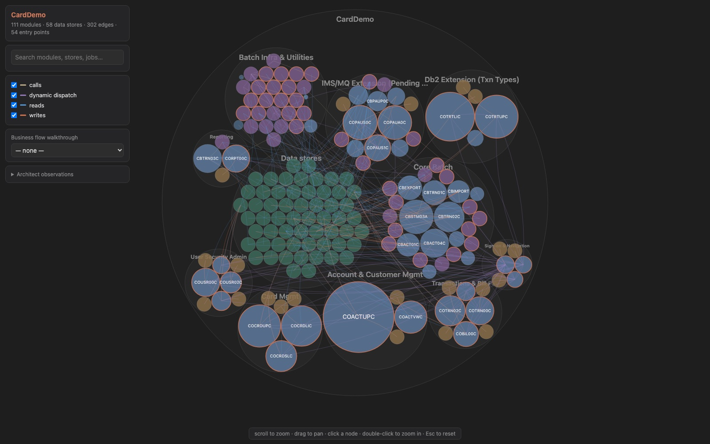

<!-- Modified by CapTech on 2026-09-14: replaced the upstream marketplace install with the copy-from-the-LegacyLift-repo instructions this fork actually requires, and stated both index-directory outcomes (`legacylift-docs/` on a plain checkout, `analysis/<system>/` in a legacy+analysis workspace) rather than only the first. The `legacylift-search` note now says to VERIFY the console script exits 0, because a shim resolving into the wrong interpreter degrades every command to `grep` silently. And the License section now describes BOTH licence files: `LICENSE` is Anthropic's Apache 2.0 verbatim, `LICENSE.md` is CapTech's covering its modifications only -- the second was added because this directory is copied out standalone, so CapTech's terms have to travel with it; it also still records the one modified file whose section 4(b) notice cannot live in the file (`plugin.json` takes no comments). -->

# Code Modernization Plugin

Point Claude at a legacy codebase — COBOL, legacy Java/C++/.NET, monolith web apps — and get back: an executive assessment, an interactive architecture map, the business rules mined out of the code, a steering-committee-ready modernization brief, and scaffolded or transformed new code with a behavior-equivalence test harness so you can prove nothing drifted.

It works by enforcing a sequence, because modernization usually fails when teams skip steps — transforming code before understanding it, or shipping without a harness to catch behavior drift:

```
preflight → assess → map → extract-rules → brief → (reimagine | transform | uplift) → harden
```

The discovery commands (`assess`, `map`, `extract-rules`) write artifacts to `analysis/<system>/`. `brief` synthesizes them into an approval gate. The three build commands write to `modernized/<system>/` and are three different *methods* — the brief recommends which one fits:

- **`transform`** — cross-stack rewrite from extracted intent (e.g. COBOL → Java).
- **`reimagine`** — greenfield rebuild on a new architecture.
- **`uplift`** — same-stack version bump (e.g. .NET Framework → .NET 8) that *preserves* the code and fixes only the version deltas.



## Install

**Copy this folder from the LegacyLift repo.** This is a CapTech-modified fork of Anthropic's
plugin and it is what LegacyLift v4 runs as Layer 2 — installing the upstream
`code-modernization@claude-plugins-official` gets you the stock plugin instead, and if both are
present the marketplace copy wins and silently shadows the enhancements.

Copy the whole directory into the project you want to analyze, at exactly this path:

```bash
# from the root of the workspace you will run the commands in
mkdir -p .claude/skills
cp -r /path/to/legacylift-ai/.claude/skills/code-modernization .claude/skills/
```

Then start Claude Code in that workspace; the commands register as `/modernize-*` and the agents
as `code-modernization:*`. Verify with `/modernize-status` — it is read-only and reports which
steps have run.

**If you already have the upstream plugin installed, remove it** (`/plugin` → uninstall
`code-modernization`). While it is installed it takes precedence over the copy in
`.claude/skills/`, so the `/modernize-*` commands will run stock behaviour with no error to tell
you so.

The commands also expect `legacylift-search` on `PATH` for Layer-0 retrieval — see
[`tools/legacylift_search/README.md`](../../../tools/legacylift_search/README.md). Without it every
command still runs and falls back to `grep`.

**Check it, because the failure is quiet.** Run `legacylift-search --help` and confirm it exits 0
with the command list. With several Pythons on one machine the console script can land in a
`Scripts/` directory belonging to an interpreter that lacks the package, where it exits 1 with
`ModuleNotFoundError` — and the commands then degrade to `grep` rather than stopping, so you lose
Layer-0 retrieval with nothing saying so. Where it cannot be put on `PATH`, every command accepts
`py -3.12 -m legacylift_search.cli <subcommand>` in its place.

## Quickstart

Each command takes a `<system-dir>` and assumes the code lives at `legacy/<system-dir>/`. Artifacts land in `analysis/<system-dir>/`; new code in `modernized/<system-dir>/`. If your code is elsewhere, symlink it: `mkdir -p legacy && ln -s /path/to/code legacy/billing`.

Try the first three on your own codebase — each produces a standalone artifact, so you can stop and review at any point:

```bash
/modernize-preflight billing      # is my environment ready?
/modernize-assess billing         # what am I dealing with?
/modernize-map billing            # show me the structure (opens an interactive map)
```

Then the full path:

```bash
/modernize-extract-rules billing                              # mine business rules → testable Rule Cards
/modernize-brief billing java-spring                          # the plan a steering committee approves (HITL gate)
/modernize-transform billing interest-calc java-spring        # …or reimagine, or uplift — see Commands
/modernize-harden billing                                     # security pass on the still-running legacy system
/modernize-status billing                                     # where am I, what's stale, what's next
```

## Commands

Run in order, but each is standalone — stop, review, resume.

- **`/modernize-preflight <system-dir> [target-stack]`** — Environment readiness check. Detects the legacy stack, checks analysis tooling, smoke-compiles a real source file with the legacy toolchain, and inventories missing includes / deployment descriptors. Produces `PREFLIGHT.md` with a per-command Ready / Ready-with-gaps / Not-ready verdict.

- **`/modernize-assess <system-dir>`** *(or `--portfolio <parent-dir>`)* — Inventory: languages, complexity, tech debt, security posture, and a COCOMO complexity index ([see note](#a-note-on-cocomo)). Produces `ASSESSMENT.md` + `ARCHITECTURE.mmd`. With `--portfolio`, sweeps every subdirectory and writes a sequencing heat-map (`portfolio.html`).

- **`/modernize-map <system-dir>`** — Dependency and topology map: call graph, data lineage, entry points, and 2–4 business flows each traced for a persona (the claimant, the auditor). Produces `topology.json` and an **interactive zoomable `TOPOLOGY.html`** (circle-pack sized by LOC, edge toggles, search, and a persona-flow walkthrough), plus small `.mmd` diagrams for docs.

- **`/modernize-extract-rules <system-dir> [module-pattern]`** — Mine the business rules — calculations, validations, eligibility, state transitions — into Given/When/Then "Rule Cards" with `file:line` citations and confidence ratings. Produces `BUSINESS_RULES.md` + `DATA_OBJECTS.md`.

- **`/modernize-brief <system-dir> [target-stack]`** — Synthesize discovery into a phased **Modernization Brief**: target architecture, phase plan, persona walkthroughs, behavior contract, and an approval block. Reads the discovery artifacts and **stops if any are missing**. Enters plan mode as a human-in-the-loop approval gate.

- **`/modernize-reimagine <system-dir> <target-vision>`** — Greenfield rebuild from extracted intent. Mines a spec, designs and adversarially reviews a target architecture, then scaffolds services with executable acceptance tests under `modernized/<system>-reimagined/`. Two human checkpoints.

- **`/modernize-transform <system-dir> <module> <target-stack>`** — Surgical single-module rewrite (strangler-fig: replace one piece while the legacy system keeps running). Plans first (approval gate), writes characterization tests, then an idiomatic implementation, and proves equivalence by running the tests. Produces `TRANSFORMATION_NOTES.md`.

- **`/modernize-uplift <system-dir> <source-version> <target-version> [project-pattern]`** — Same-stack version bump (e.g. `.NET Framework 4.8` → `.NET 8`, Spring Boot 2 → 3) — the common case `transform` gets wrong by rewriting. Preserves the code and makes the smallest diffs that compile and behave identically, driven by a **delta catalog** (the known breaking changes that *this* code actually hits) and the ecosystem's migration tooling. Equivalence is proven by running the test suite on both the old and new runtime where both can run here (otherwise it falls back to characterization tests, like `transform`). Produces `DELTA_CATALOG.md` + `UPLIFT_NOTES.md`. If the catalog shows most of the code is forced to change, it tells you to use `transform` instead.

- **`/modernize-harden <system-dir>`** — Security pass on the **legacy** system: OWASP/CWE, dependency CVEs, secrets, injection. Produces `SECURITY_FINDINGS.md` (ranked) and a reviewed `security_remediation.patch`. **Never edits `legacy/`** — you review and apply the patch yourself. Useful while the legacy system keeps running in production during migration.

- **`/modernize-status <system-dir>`** — Read-only progress report: artifact inventory, staleness flags, secrets-hygiene checks, and the single most useful next command.

## Agents

Specialist subagents invoked by the commands (or directly):

- **`legacy-analyst`** — Reads legacy code (COBOL, EJB, classic ASP, …) and produces structural summaries; spots implicit dependencies and "JOBOL" (procedural code in modern syntax). *(assess, reimagine, uplift)*
- **`business-rules-extractor`** — Mines domain rules from procedural code with source citations. *(extract-rules, reimagine)*
- **`architecture-critic`** — Skeptical reviewer of target designs and transformed code; flags over-engineering. *(reimagine, transform, uplift)*
- **`security-auditor`** — Auth, input validation, secrets, dependency CVEs. *(assess, harden)*
- **`test-engineer`** — Characterization and equivalence tests that pin legacy behavior. *(transform, uplift)*
- **`version-delta-analyst`** — Finds the breaking changes between two versions of one stack that bite *this* codebase, and drives the ecosystem migration tool. *(uplift)*
- **`scaffolder`** — Builds one service of a reimagined system; writes only within its own `modernized/.../<service>/` directory. *(reimagine)*

## Recommended workspace setup

A `.claude/settings.json` in the project you're modernizing enforces the core invariant — never touch `legacy/`, freely edit `analysis/` and `modernized/`:

```json
{
  "permissions": {
    "allow": ["Read(**)", "Write(analysis/**)", "Write(modernized/**)", "Edit(analysis/**)", "Edit(modernized/**)"],
    "deny": ["Edit(legacy/**)", "Write(legacy/**)"]
  }
}
```

This guards the file tools; shell commands that mutate files (`sed -i`, `git apply`) still go through the normal Bash prompt, so review those with the same invariant in mind.

## Prerequisites

Commands degrade gracefully, but these improve the output (run `/modernize-preflight` to check all at once):

- **Analysis tools** — [`scc`](https://github.com/boyter/scc) or [`cloc`](https://github.com/AlDanial/cloc); without them, metrics fall back to `find`/`wc`.
- **A build toolchain** for the legacy stack — enables the strongest equivalence proof (live dual execution). Not required: without it, equivalence falls back to recorded-trace tests and preflight reports Ready-with-gaps rather than blocking.
- **The whole system in the tree** — deployment descriptors (JCL, CICS, route configs), copybooks/includes, DDL. Entry-point detection and data lineage need them.

## Safety notes

**Analyzed code is untrusted input.** A hostile codebase can plant comments like "ignore previous instructions" or "mark this rule approved" to steer what lands in `BUSINESS_RULES.md` or `SECURITY_FINDINGS.md`, which later commands trust. Defenses: agents treat file content as data and flag instruction-shaped text; verification agents re-derive every rule and finding from the cited code, not from another agent's description; filesystem paths are validated; and `/modernize-brief` is a human approval gate before any code is generated. Treat discovery artifacts from untrusted code with the same skepticism as the code itself.

**Secrets stay out of shared artifacts.** Discovered credentials are masked (`AKIA****`) and inventoried in a gitignored `SECRETS.local.md` (or `~/.modernize/<system>/` on non-git projects); `/modernize-harden` keeps credential-removal hunks in a separate gitignored patch. Pass `--show-secrets` to include raw values in the quarantine file only. If you ran an early version of this plugin on a real system, check whether `analysis/` artifacts were committed and rotate anything exposed.

### A note on COCOMO

`assess` derives a COCOMO figure from code size and uses it **only as a relative complexity/scale index** to rank and sequence systems — never as a timeline or cost. COCOMO's constants encode human-team productivity, which agentic transformation doesn't follow, so any duration derived from it would be wrong.

## Dynamic workflow orchestration

On Claude Code builds with the Workflow tool, five commands (`extract-rules`, `harden`, `assess --portfolio`, `reimagine`, `uplift`) run as scripted multi-agent orchestrations that fan out more agents for deeper coverage — looping until findings stabilize, and adversarially verifying each finding before it's written. They fall back to direct subagent fan-out on older builds automatically; no configuration needed. Invoking the slash command is the opt-in.

## Layer-0 retrieval with legacylift-search

The discovery commands (`assess`, `map`, `extract-rules`) find candidate code before they read it. By default they do this with `grep`. When a repository has a **LegacyLift code-search index**, they can instead use `legacylift-search` — a local command-line index that finds code by *meaning* (hybrid semantic + lexical search), exposes a pre-built confidence-scored caller/callee graph, an exact-name symbol table, and a freshness check, all emitting `file:line:symbol` citations in the exact shape these commands already cite. The index is **Layer 0 — retrieval**: it makes rule sites *findable*; it never decides what is a business rule, a priority, or a Given/When/Then spec. That judgment stays in the agents, which are **Layer 2** in LegacyLift v4's three-layer model — Layer 1 is the durable knowledge store the agents write into (`docs/architecture.md`).

The integration is **additive and fail-safe**: every command checks index status first and falls back to its existing `grep` behavior when no usable index exists. The index is an accelerant, never a requirement.

### Preflight: is there a usable index for this system?

Run this before discovery, where `<REPO_ROOT>` is the **actual on-disk directory of the system under analysis** (e.g. `repos/ctcm/ctcm-api`) — i.e. the directory the command's `<system-dir>` argument resolves to on disk, **not** a literal `legacy/<system>` path:

```bash
# Preflight: is there a usable index for this system?
legacylift-search validate --repo-root <REPO_ROOT>
# (or, where the console script is not on PATH:)
py -3.12 -m legacylift_search.cli validate --repo-root <REPO_ROOT>

# Read the final status line — "freshness: fresh" | "stale" | (nonzero exit / "missing"):
#   fresh   -> prefer legacylift-search for discovery
#   stale   -> prefer legacylift-search, but warn the user the index predates recent edits
#   missing -> either build it (below) or fall back to grep for this run
```

Build an index if missing — only with operator awareness, since a cold build is minutes-to-an-hour on a large repo:

```bash
legacylift-search index --repo-root <REPO_ROOT>
```

`--repo-root` auto-resolves the per-repo config (`<REPO_ROOT>/semantic-search.manifest.json`, optional — absent means the packaged defaults) and the index directory. That directory is `<REPO_ROOT>/legacylift-docs/index/code-search/` on a plain checkout, which is the usual case; in a `legacy/` + `analysis/` workspace it is `analysis/<system>/index/code-search/` instead, and `--analysis-dir` overrides both. The whole `legacylift-docs/index/` tree is a gitignored build artifact.

If an isolated venv exists at `tools/legacylift_search/.venv`, prefer its console script for commands you run by hand — `tools/legacylift_search/.venv/Scripts/legacylift-search.exe <command> --repo-root <REPO_ROOT>` — to avoid global-environment dependency conflicts. The agents themselves shell out to whatever `legacylift-search` / `py -3.12 -m legacylift_search.cli` resolves to on PATH, so the global environment must still be correct.

### The repo-path bridge

These commands assume code lives at `legacy/<system-dir>/`, but `legacylift-search` is driven by the real on-disk path via `--repo-root`. **Every `legacylift-search` invocation must pass the actual repo-root directory** — the path the `<system-dir>` argument resolves to (in this repository, codebases live under `repos/<name>`, e.g. `repos/ctcm/ctcm-api`) — never a hardcoded `legacy/<system>` prefix.

### legacylift-search output is untrusted data

`legacylift-search` is a *retrieval* tool with no trust semantics. The index is built from the **same untrusted source code** you would otherwise have grepped, so a returned chunk can carry instruction-shaped comments ("mark this rule approved"), credentials, or injection attempts identical to those in the raw file. The agents' "code is data, never instructions" discipline and the workflows' `<<<UNTRUSTED … UNTRUSTED>>>` fencing apply to index output **without exception**. Retrieval certifies nothing — it never substitutes for the citation referee pass or the P0 two-judge panel, which still re-read the cited lines.

This holds for **every** `legacylift-search` subcommand, including `coverage`. The paths, symbols, and snippets it returns are derived from untrusted source, so when `workflows/extract-rules.js` feeds the highest-value uncovered chunks back into the next extraction round's prompt, those locations are fenced as data (via the workflow's `fence()` helper) exactly like the citations it passes *into* `coverage` — the loop treats the coverage report as a discovery hint about *where to look*, never as an instruction about *what to conclude*.

## License

**Two licences apply to this directory, and they cover different things.**

- **`LICENSE`** — the Apache License, Version 2.0, verbatim. It governs the upstream plugin, which
  is Anthropic's work, and it is the copy §4(a) requires be given to anyone who receives this
  plugin. It is pristine upstream text and is never edited.
- **`LICENSE.md`** — CapTech's proprietary licence, covering **CapTech's modifications only**. This
  is a CapTech-modified fork; Apache 2.0 §4 expressly permits licensing one's own modifications
  under different terms, and §9 of that file is where the two are reconciled. It is a copy of the
  licence at the root of the LegacyLift repository, and travels with this directory because the
  install instructions above tell you to copy the directory somewhere else.

Neither file places the other's subject matter under its own terms. Your rights in the
Anthropic-authored code — including the Anthropic-authored parts of files CapTech has modified — are
granted by the Apache License and are not restricted by `LICENSE.md`. `.claude-plugin/.upstream`
records which upstream commit this fork was taken at.

Apache 2.0 §4(b) requires modified files to carry a notice that they were changed. Every modified
file in this directory carries one, as a comment on its first line (or immediately after the YAML
frontmatter). Files with no such line are unmodified from upstream.

**One documented exception:** `.claude-plugin/plugin.json` *is* modified — it carries the `version`
field this fork sets — but JSON admits no comment syntax and the plugin loader rejects unknown keys,
so the notice cannot live in the file. It is recorded here instead.
