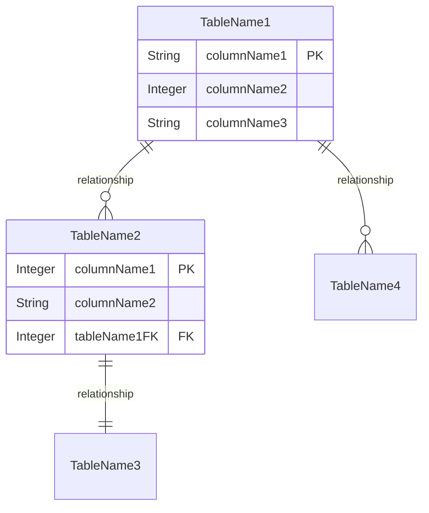

# Data Dictionary: {DOMAIN_NAME} Domain

<!--
⚠️ CRITICAL REQUIREMENTS ⚠️

1. **EXHAUSTIVE DOCUMENTATION**: Document EVERY table, EVERY column. NO summaries, NO placeholders, NO samples.
   - If domain has 42 tables → Document all 42 tables
   - If tables have 687 total columns → Document all 687 columns
   - NO "Additional tables follow similar pattern"
   - NO "Other columns include..."

2. **LOGICAL DATA TYPES**: Use database-agnostic logical types
   - String(length), Integer, Decimal(precision,scale), Boolean, Date, DateTime
   - NO SQL syntax: NO VARCHAR, NO INT, NO NUMERIC
   - Always include length/precision: String(50), Decimal(18,2)

3. **CITATIONS INLINE**: Every table, column, constraint cited AS YOU WRITE
   - Table [📄](path/table.sql:line)
   - Column definition [📄](path/table.sql:columnLine)
   - Constraint [📄](path/table.sql:constraintLine)

4. **INCREMENTAL WRITING**: Use marker replacement for long documents
   - Write first 5-10 tables
   - Add marker: <!-- MORE CONTENT TO FOLLOW -->
   - Use Edit tool to replace marker with next batch + marker
   - Repeat until ALL tables documented
   - Final section: remove marker

WORKFLOW:
  For each table (ALL tables, no exceptions):
    1. Read DDL file NOW
    2. Extract ALL columns
    3. Translate SQL types → Logical types
    4. Write table WITH ALL columns
    5. Cite every column definition
    6. Move to next table

NEVER write a column without:
  - Logical data type with length/precision
  - Required/Optional
  - Description
  - Citation to DDL
-->

## Who Should Read This

This document is intended for:
- **Data Architects**: Complete logical data model for target platform design
- **ETL Developers**: Source data structure for data migration
- **Database Administrators**: Schema design and optimization
- **Data Modelers**: Entity relationship and constraint specifications
- **Migration Teams**: Complete field-level specifications for any target database

**Prerequisites**: Understanding of relational database concepts and data modeling

**Reading Time**: 90-120 minutes

---

## Document Scope

**This is a complete, exhaustive, database-agnostic data dictionary for the {DOMAIN_NAME} domain.**

This documentation provides:
- **EVERY table** in the domain with complete specifications
- **EVERY column** with logical data type, required/optional, and business description
- **ALL constraints** documented as business rules
- **ALL relationships** with cardinality and cascade behavior
- **Logical data types** (String, Integer, Decimal, etc.) suitable for any target platform
- **NO SQL syntax** - platform-independent specifications

**This IS a complete technical reference.** Every table and column is documented. Use this for:
- Data migration planning to any target database (PostgreSQL, Oracle, cloud databases)
- ETL design and data mapping
- Target schema design
- Data quality validation
- Business analysis of data structures

---

## Table of Contents

1. [Domain Overview](#domain-overview)
2. [Domain Statistics](#domain-statistics)
3. [Logical Data Type Reference](#logical-data-type-reference)
4. [Tables](#tables)
5. [Relationship Summary](#relationship-summary)
6. [Cross-Domain Integration](#cross-domain-integration)

---

## Domain Overview

### Domain Purpose

{DOMAIN_DESCRIPTION} - What this domain represents in the business context.

### Scope

This domain encompasses:
- {SCOPE_ITEM_1}
- {SCOPE_ITEM_2}
- {SCOPE_ITEM_3}

---

## Domain Statistics

| Metric | Count | Notes |
|--------|-------|-------|
| **Total Tables** | {TABLE_COUNT} | All tables documented in this dictionary |
| **Total Columns** | {COLUMN_COUNT} | All columns across all tables |
| **Primary Keys** | {PK_COUNT} | Tables with primary keys |
| **Foreign Keys** | {FK_COUNT} | Relationships between tables |
| **Unique Constraints** | {UNIQUE_COUNT} | Business uniqueness rules |
| **Check Constraints** | {CHECK_COUNT} | Business validation rules |

---

## Logical Data Type Reference

This data dictionary uses **logical data types** that can be implemented in any database platform:

| Logical Type | Description | Example | Common Uses |
|--------------|-------------|---------|-------------|
| **String(n)** | Variable-length text, max n characters | String(50) | Names, descriptions, codes |
| **String(max)** | Large text, no length limit | String(max) | Long descriptions, notes |
| **Integer** | Whole number | Integer | IDs, counts, quantities |
| **Decimal(p,s)** | Fixed-point number, p digits with s after decimal | Decimal(18,2) | Currency, precise measurements |
| **Float** | Approximate decimal | Float | Scientific calculations |
| **Boolean** | True/False value | Boolean | Flags, yes/no indicators |
| **Date** | Calendar date (no time) | Date | Birth dates, effective dates |
| **DateTime** | Date with time | DateTime | Timestamps, audit dates |
| **Time** | Time of day (no date) | Time | Business hours, duration |
| **Binary** | Binary data | Binary | Files, images, documents |
| **GUID** | Globally unique identifier | GUID | Distributed system IDs |

**Note**: SQL Server types translated as follows:
- VARCHAR/CHAR/NVARCHAR → String(n)
- INT/BIGINT/SMALLINT → Integer
- DECIMAL/NUMERIC/MONEY → Decimal(p,s)
- BIT/CHAR(1) → Boolean
- DATETIME/DATETIME2 → DateTime

---

## Tables

### Table: {TableName1}

**Purpose**: {Business description of what this table represents}

**Source**: [📄]({DDL_PATH}:line)

**Primary Key**: {column1}, {column2}

#### Columns

| Column Name | Data Type | Required | Default | Description | Valid Values | Constraints |
|-------------|-----------|----------|---------|-------------|--------------|-------------|
| {columnName} | String(50) | Yes | - | {Business meaning - what this represents} | {Examples or valid values} | PK [📄]({DDL_PATH}:line) |
| {columnName2} | Integer | Yes | - | {Business meaning} | {Value range or examples} | PK [📄]({DDL_PATH}:line) |
| {columnName3} | String(100) | No | NULL | {Business meaning} | Free text | [📄]({DDL_PATH}:line) |
| {columnName4} | Decimal(18,2) | Yes | 0.00 | {Business meaning} | >= 0.00 | CHECK >= 0 [📄]({DDL_PATH}:line) |
| {columnName5} | Boolean | Yes | False | {Business meaning} | True/False | [📄]({DDL_PATH}:line) |
| {columnName6} | DateTime | Yes | CURRENT | {Business meaning} | Timestamp | [📄]({DDL_PATH}:line) |
| ... | ... | ... | ... | ... | ... | ... |

**Important**: Document EVERY column. Do not use "..." in actual documentation.

#### Relationships

**Foreign Keys**:
- **{RelationshipName}** [📄]({DDL_PATH}:line)
  - **Parent**: {ParentTable}.{ParentColumn}
  - **Child**: {ThisTable}.{ThisColumn}
  - **Cardinality**: One {ParentTable} to Many {ThisTable} (required/optional)
  - **Cascade**: ON DELETE {CASCADE|RESTRICT|SET NULL}, ON UPDATE {CASCADE|RESTRICT}
  - **Business Rule**: {What this relationship means in business terms}

**Referenced By**:
- {ChildTable}.{ChildColumn} → {ThisTable}.{ThisColumn}

#### Indexes

| Index Name | Type | Columns | Purpose |
|------------|------|---------|---------|
| PK_{Table} | Primary Key | {column1}, {column2} | Unique identifier [📄]({DDL_PATH}:line) |
| FK_{Table}_{RefTable} | Foreign Key | {columnFK} | Relationship lookup [📄]({DDL_PATH}:line) |
| UQ_{Table}_{Column} | Unique | {column} | Business uniqueness rule [📄]({DDL_PATH}:line) |
| IX_{Table}_{Column} | Non-Unique | {column} | Query performance [📄]({DDL_PATH}:line) |

#### Constraints

| Constraint Name | Type | Definition | Business Rule |
|----------------|------|------------|---------------|
| PK_{Table} | Primary Key | {column1}, {column2} | Unique identifier [📄]({DDL_PATH}:line) |
| FK_{Table}_{Ref} | Foreign Key | {column} REFERENCES {RefTable}({RefColumn}) | {Business relationship} [📄]({DDL_PATH}:line) |
| CHK_{Table}_{Rule} | Check | {column} >= 0 | {Business validation} [📄]({DDL_PATH}:line) |
| UQ_{Table}_{Column} | Unique | {column} | {Uniqueness rule} [📄]({DDL_PATH}:line) |
| DF_{Table}_{Column} | Default | {column} = {value} | {Default behavior} [📄]({DDL_PATH}:line) |

---

### Table: {TableName2}

**Purpose**: {Business description}

**Source**: [📄]({DDL_PATH}:line)

**Primary Key**: {column}

#### Columns

| Column Name | Data Type | Required | Default | Description | Valid Values | Constraints |
|-------------|-----------|----------|---------|-------------|--------------|-------------|
| ... | ... | ... | ... | ... | ... | ... |

[Document ALL columns with complete specifications]

[Continue this pattern for EVERY table in the domain]

---

### Table: {TableName3}

[Complete specification with ALL columns]

---

[IMPORTANT: Continue documenting EVERY table with EVERY column until ALL tables in the domain are documented]

---

<!-- MORE CONTENT TO FOLLOW -->

## Relationship Summary

### Domain Entity Relationship Diagram

### All Foreign Key Relationships

| Child Table | Child Column | Parent Table | Parent Column | Cardinality | Required | Cascade Delete | Cascade Update |
|-------------|--------------|--------------|---------------|-------------|----------|----------------|----------------|
| {ChildTable} | {column} | {ParentTable} | {column} | One-to-Many | Yes | CASCADE | RESTRICT |
| {ChildTable2} | {column} | {ParentTable2} | {column} | One-to-One | No | SET NULL | CASCADE |

[Document ALL foreign key relationships]

---

## Cross-Domain Integration

### Integration Points

This domain integrates with other domains through the following relationships:

#### Integration with {OtherDomain1}

**Tables Involved**:
- {ThisDomainTable} → {OtherDomainTable}

**Relationship**:
- Foreign key from {ThisDomainTable}.{column} to {OtherDomainTable}.{column}
- Cardinality: {relationship type}
- Business Purpose: {why these domains are connected}

#### Integration with {OtherDomain2}

[Document each cross-domain integration]

---

## Data Volume Estimates

| Table | Estimated Rows | Growth Rate | Notes |
|-------|----------------|-------------|-------|
| {TableName1} | {count} | {rate} | {notes about data volume} |
| {TableName2} | {count} | {rate} | {notes} |

[Document volume estimates for capacity planning]

---

## Migration Considerations

### Data Type Translation Notes

When migrating to target platforms, consider:

**PostgreSQL**:
- String(n) → VARCHAR(n)
- Integer → INTEGER or BIGINT
- Decimal(p,s) → NUMERIC(p,s)
- Boolean → BOOLEAN
- DateTime → TIMESTAMP

**Oracle**:
- String(n) → VARCHAR2(n)
- Integer → NUMBER(38)
- Decimal(p,s) → NUMBER(p,s)
- Boolean → NUMBER(1) with CHECK constraint
- DateTime → TIMESTAMP

**Cloud Databases** (AWS RDS, Azure SQL, GCP Cloud SQL):
- Follow PostgreSQL or SQL Server patterns depending on engine
- Consider managed service features for constraints and indexes

### Constraint Implementation

All constraints documented in this dictionary should be implemented in target database:
- Primary keys ensure data integrity
- Foreign keys maintain referential integrity
- Check constraints enforce business rules
- Unique constraints prevent duplicates

---

## Related Documents

- [Database Layer Documentation ({DOMAIN})](02-DATA-MODEL-AND-RELATIONSHIPS-{DOMAIN}.md) - Business logic and modernization focus
- [System Architecture](01-SYSTEM-ARCHITECTURE.md) - Overall system architecture
- [Data Model & Relationships (Full System)](02-DATA-MODEL-AND-RELATIONSHIPS.md) - Complete system data model

---

*Generated By LegacyLift AI by CapTech*
*Generated on: {GENERATED_DATE}*