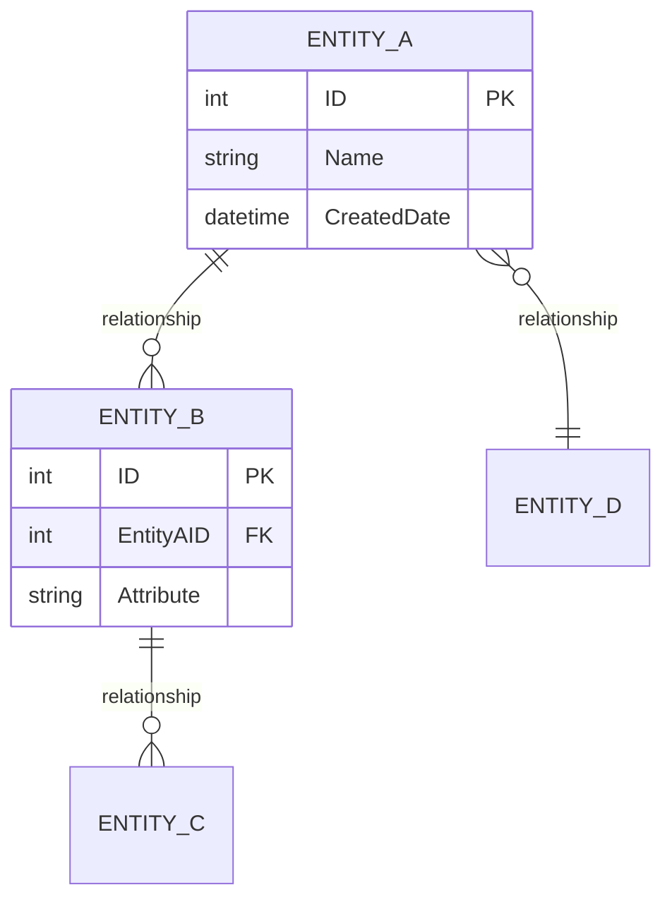
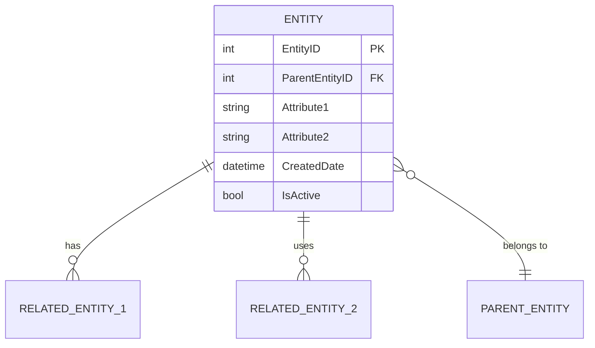
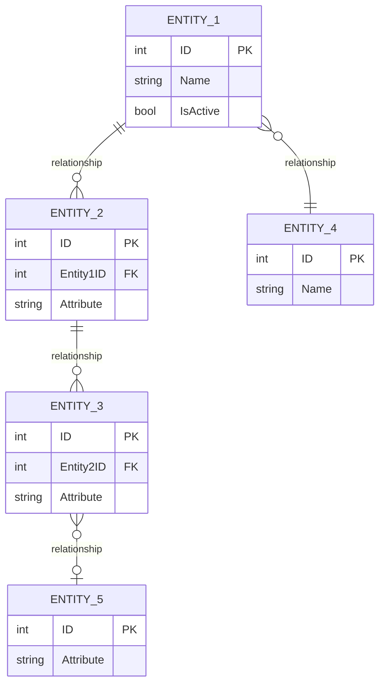
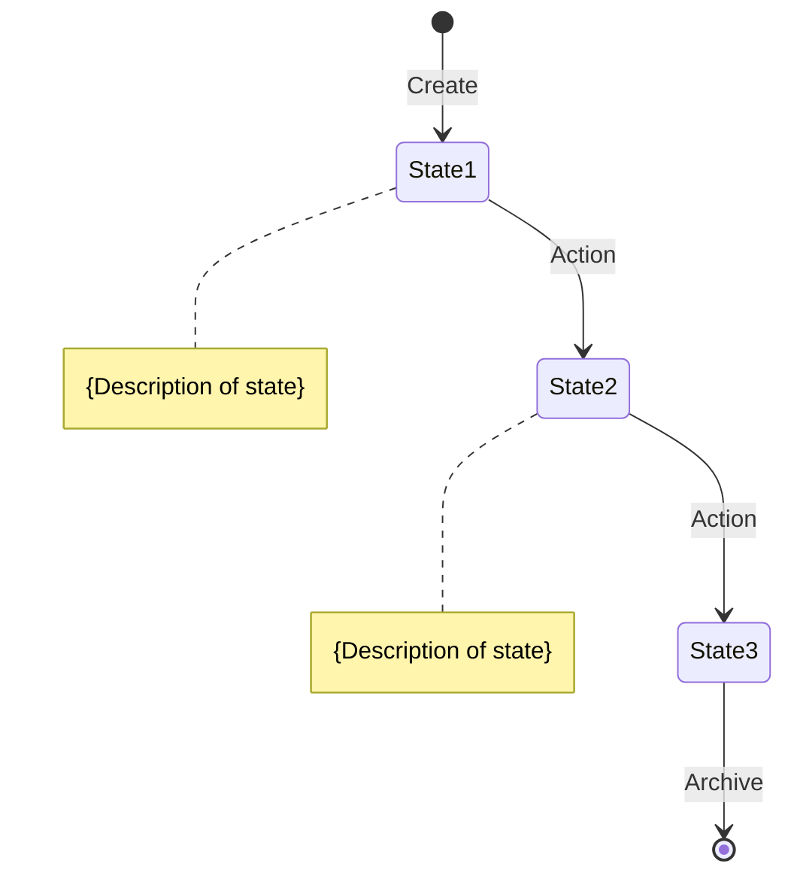
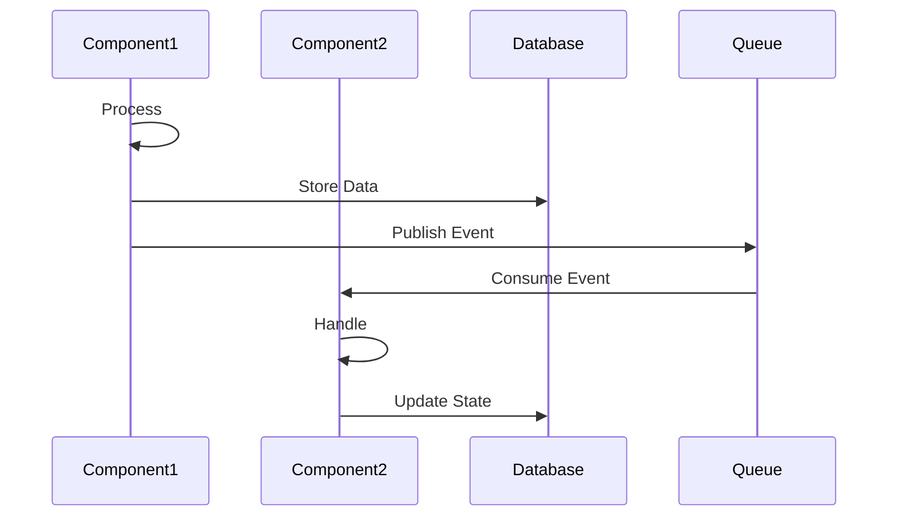
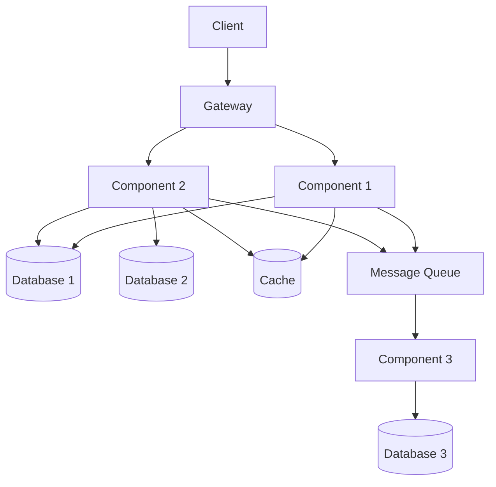

# Data Model & Relationships: {PROJECT_NAME}

<!--
⚠️ CRITICAL CITATION REQUIREMENTS ⚠️

EVERY entity, attribute, relationship, and data constraint MUST have an inline citation.
This document describes the data model - every claim must be verifiable.

WORKFLOW FOR WRITING THIS DOCUMENT:
1. Search for model classes, schema files, migrations BEFORE writing each section
2. Gather all file paths and line numbers BEFORE writing prose
3. Write WITH citations inline - never describe a data structure without citing its definition
4. Use format: "Entity/Field [📄](path/to/model:line)"
5. Validate every claim has a citation before moving to next section

WHAT NEEDS CITATIONS:
✅ Every entity/model name (cite model class, schema definition, or table creation)
✅ Every field/attribute (cite model property or schema column definition)
✅ Every relationship (cite foreign keys, references, ORM relationships)
✅ Every constraint (cite validation code, database constraints, check constraints)
✅ Every enum/type (cite enum definition, type alias, or validation logic)
✅ Every migration (cite migration file)
✅ Every data access pattern (cite repository method, query, or ORM usage)

GOOD EXAMPLE:
"The User entity [📄](src/models/User.ts:8) has an email field [📄](src/models/User.ts:12) with a unique constraint [📄](src/models/User.ts:13) and relates to Orders [📄](src/models/User.ts:45) via one-to-many."

BAD EXAMPLE:
"The User entity has an email field with a unique constraint and relates to Orders via one-to-many."
↑ No citations - unacceptable

TEMPLATE INSTRUCTIONS:
- Replace {PROJECT_NAME} with actual project name
- Search for model definitions BEFORE writing each entity section
- Cite every entity, field, relationship with [📄](path/file:line)
- Create ERD diagrams based on actual model code
- Document cardinality found in actual code
- NEVER write about fields/entities without citing their definitions
- Do not confabulate - every claim must be verifiable from source code
-->

## Who Should Read This

This document is intended for:
- **Software Engineers**: Understand data structures and relationships
- **Database Administrators**: Learn schema design and data management
- **Data Analysts**: Understand available data for reporting
- **Solution Architects**: Design integrations and data flows
- **Product Managers**: Understand core business concepts and their relationships

**Prerequisites**: Basic understanding of {database concepts}

**Reading Time**: 50-60 minutes

---

## Table of Contents

1. [Data Architecture Overview](#data-architecture-overview)
2. [{Primary Data Organization}](#primary-data-organization)
3. [Core Domain Entities](#core-domain-entities)
4. [Entity Relationship Diagrams](#entity-relationship-diagrams)
5. [Relationship Rules & Cardinality](#relationship-rules--cardinality)
6. [Data Lifecycle & State Management](#data-lifecycle--state-management)
7. [Data Flow Across {System Components}](#data-flow-across-system-components)
8. [Database Schema Strategy](#database-schema-strategy)
9. [Data Integrity & Constraints](#data-integrity--constraints)
10. [Migration & Versioning](#migration--versioning)

---

## Data Architecture Overview

### Database Organization

{PROJECT_NAME} uses a **{data strategy}** with {database configuration}.

```mermaid
graph TB
    subgraph "{Primary Database Technology}"
        DB1[(Database 1<br/>{Purpose})]
        DB2[(Database 2<br/>{Purpose})]
        DB3[(Database 3<br/>{Purpose})]
    end

    subgraph "{Secondary Storage}"
        CACHE[(Cache<br/>{Purpose})]
        STORAGE[Storage<br/>{Purpose}]]
    end
```

### Database Purposes

| Database | Purpose | Key Tables/Collections |
|----------|---------|------------------------|
| **{Database 1}** [[source]](file:line) | {Purpose} | {Key tables} |
| **{Database 2}** [[source]](file:line) | {Purpose} | {Key tables} |
| **{Database 3}** [[source]](file:line) | {Purpose} | {Key tables} |

---

## {Primary Data Organization}

{PROJECT_NAME} {organization description, e.g., "is a multi-tenant system", "uses domain-driven design", etc.}

### {Organizational Hierarchy}

```mermaid
graph TD
    TOP[{Top Level Entity}] --> L1A[{Level 1 Entity A}]
    TOP --> L1B[{Level 1 Entity B}]

    L1A --> L2A[{Level 2 Entity A}]
    L1A --> L2B[{Level 2 Entity B}]

    L2A --> L3[{Level 3 Entity}]
```

### {Organization} Rules

1. **{Rule 1}**: {Description} [[source]](file:line)
2. **{Rule 2}**: {Description} [[source]](file:line)
3. **{Rule 3}**: {Description} [[source]](file:line)

### {Key Relationship Diagram}



---

## Core Domain Entities

### 1. {Entity Name} [[source]](file:line)

**Purpose**: {Description of what this entity represents}



**Key Attributes**:
- **{AttributeName}**: {Description and constraints} [[source]](file:line)
- **{AttributeName}**: {Description and constraints} [[source]](file:line)
- **{AttributeName}**: {Description and constraints} [[source]](file:line)

<!-- Repeat for each core entity -->

---

## Entity Relationship Diagrams

### Complete {Domain Area} ERD



<!-- Add additional ERDs for different domain areas -->

---

## Relationship Rules & Cardinality

### {Entity} Relationships

| Relationship | Cardinality | Rules | Source |
|--------------|-------------|-------|--------|
| {Entity} → {Related Entity} | {One-to-Many/Many-to-One/etc.} | {Business rules} | [[source]](file:line) |
| {Entity} → {Related Entity} | {Cardinality} | {Business rules} | [[source]](file:line) |
| {Entity} → {Related Entity} | {Cardinality} | {Business rules} | [[source]](file:line) |

**Business Rules**:
1. {Rule with enforcement mechanism} [[source]](file:line)
2. {Rule with enforcement mechanism} [[source]](file:line)
3. {Rule with enforcement mechanism} [[source]](file:line)

<!-- Repeat for other key entities -->

---

## Data Lifecycle & State Management

### {Entity} Lifecycle



**State Transitions**:
- **{State}**: {Description and triggers} [[source]](file:line)
- **{State}**: {Description and triggers} [[source]](file:line)
- **{State}**: {Description and triggers} [[source]](file:line)

### {Process} Flow



---

## Data Flow Across {System Components}

### Cross-Component Data Flow



### Data Synchronization Patterns

1. **{Pattern 1}**: {Description and use cases} [[source]](file:line)
2. **{Pattern 2}**: {Description and use cases} [[source]](file:line)
3. **{Pattern 3}**: {Description and use cases} [[source]](file:line)

### Data Ownership

| Entity | Owner | Accessed By |
|--------|-------|-------------|
| **{Entity}** [[source]](file:line) | {Owner component} | {Consuming components} |
| **{Entity}** [[source]](file:line) | {Owner component} | {Consuming components} |
| **{Entity}** [[source]](file:line) | {Owner component} | {Consuming components} |

---

## Database Schema Strategy

### Naming Conventions

**Tables**:
- {Convention description}
- {Examples}

**Columns**:
- {Convention description}
- {Examples}

**Indexes**:
- {Convention description}
- {Examples}

### Audit Columns

All core tables include [[source]](file:line):
```sql
{Column specifications}
```

### Soft Delete vs Hard Delete

| Entity Type | Strategy | Reason |
|-------------|----------|--------|
| **{Entity}** [[source]](file:line) | {Strategy} | {Reason} |
| **{Entity}** [[source]](file:line) | {Strategy} | {Reason} |
| **{Entity}** [[source]](file:line) | {Strategy} | {Reason} |

### Partitioning Strategy

**{High-volume tables}**:
- {Partitioning approach and rationale}
- {Retention policies}

---

## Data Integrity & Constraints

### Primary Keys

{Description of primary key strategy}

### Foreign Keys

**Enforcement Level**:
- **{Relationship Type}**: {Enforcement approach} [[source]](file:line)
- **{Relationship Type}**: {Enforcement approach} [[source]](file:line)

**Cascade Rules**:
- **ON DELETE**: {Approach and rationale} [[source]](file:line)
- **ON UPDATE**: {Approach and rationale} [[source]](file:line)

### Unique Constraints

| Entity | Unique Constraint | Scope |
|--------|-------------------|-------|
| **{Entity}** [[source]](file:line) | {Column(s)} | {Scope} |
| **{Entity}** [[source]](file:line) | {Column(s)} | {Scope} |

### Check Constraints

```sql
-- {Description}
ALTER TABLE {Table}
ADD CONSTRAINT {ConstraintName}
CHECK ({Condition});

-- Add more constraints as needed
```

### Business Logic Validation

**Application-Level Validation**:
- {Validation rule and reasoning} [[source]](file:line)
- {Validation rule and reasoning} [[source]](file:line)

---

## Migration & Versioning

### Schema Change Process

1. **{Step 1}**: {Description} [[source]](file:line)
2. **{Step 2}**: {Description} [[source]](file:line)
3. **{Step 3}**: {Description} [[source]](file:line)

### Migration Script Template

```sql
-- V{version}__{DescriptiveName}.sql
-- Migration: {Description}
-- Author: {Author}
-- Date: {Date}

-- Migration steps
{Migration SQL}
```

### Backward Compatibility

**Rules**:
- **{Rule}**: {Description and approach} [[source]](file:line)
- **{Rule}**: {Description and approach} [[source]](file:line)

---

## Additional Source Code References

<!-- Add actual source code references -->
**[1]** {Description}: [{file-path}]({file-path}) (Lines {start}-{end})

---

## Related Documents

- [System Architecture](01-SYSTEM-ARCHITECTURE.md)
- [Business Rules & Requirements](03-BUSINESS-RULES-AND-REQUIREMENTS.md)
- [Integration & API Guide](04-INTEGRATION-AND-API-GUIDE.md)
- [Quick Reference](05-QUICK-REFERENCE.md)

---

*Generated By LegacyLift AI by CapTech*
*Generated on: {GENERATED_DATE}*
