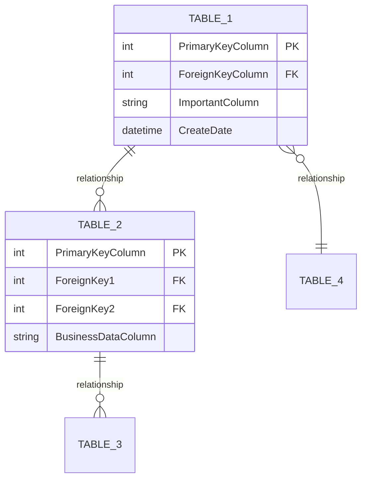
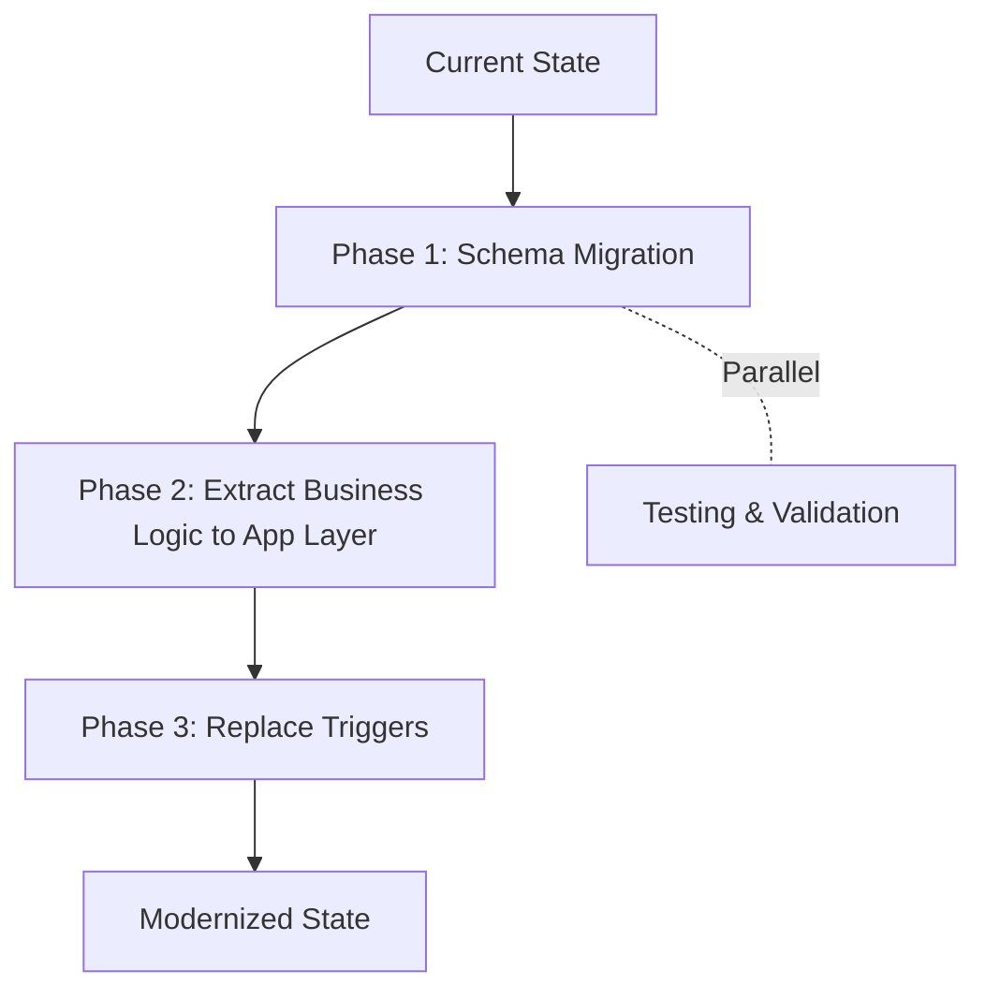

# Database Layer Analysis: {DOMAIN_NAME} Domain

<!--
⚠️ CRITICAL CITATION REQUIREMENTS ⚠️

EVERY table, stored procedure, function, trigger, and view MUST have an inline citation.
This is modernization-focused documentation - cite what's relevant for migration.

WORKFLOW FOR WRITING THIS DOCUMENT:
1. Inventory domain database objects BEFORE writing any section
2. Gather relevant DDL files and line numbers BEFORE writing prose
3. Write WITH citations inline - never describe a database object without citing its source
4. Use format: "TableName [📄](path/to/table.sql:line)" or "ProcedureName [📄](path/to/proc.sql:line)"
5. Validate every claim has a citation before moving to next section

WHAT NEEDS CITATIONS:
✅ Every table name (cite DDL file with CREATE TABLE line)
✅ Key columns (cite DDL file with column definition line)
✅ Constraints (cite DDL file with constraint definition)
✅ Stored procedures with business logic (cite procedure file)
✅ Functions with business logic (cite function file)
✅ Triggers (cite trigger file)
✅ Views (cite view file)
✅ Foreign key relationships (cite FK constraint)
✅ Business rules (cite procedure/trigger/constraint implementation)

GOOD EXAMPLE:
"The LESLegalEntity table [📄](db/tables/LESLegalEntity.sql:1) represents legal entities in the system. It has a foreign key to ETSState [📄](db/tables/LESLegalEntity.sql:20). The up_insertLESLegalEntity stored procedure [📄](db/procedures/up_insertLESLegalEntity.sql:1) enforces validation rules [📄](db/procedures/up_insertLESLegalEntity.sql:45-48)."

BAD EXAMPLE:
"The LESLegalEntity table represents legal entities. It has a foreign key to ETSState. The procedure enforces validation rules."
↑ No citations - unacceptable

TEMPLATE INSTRUCTIONS:
- Replace {DOMAIN_NAME} and all {PLACEHOLDERS} with actual values
- Gather domain database object files BEFORE writing each section
- Cite every table, procedure, function, trigger, view with [📄](path/file:line)
- Create ERD diagrams based on actual DDL
- Focus on business logic, not exhaustive column lists
- Document key tables, not every trivial lookup table
- NEVER write about objects without citing their DDL
- Do not confabulate - every claim must be verifiable from DDL files
-->

## Who Should Read This

This document is intended for:
- **Development Teams**: Understanding database layer for modernization
- **Data Engineers**: Migration planning and data model design
- **Solution Architects**: Database modernization strategies
- **Technical Leads**: Assessing technical debt and extracting business logic

**Prerequisites**: Understanding of SQL, database design, and stored procedures

**Reading Time**: 60-75 minutes

---

## Document Scope

**This document describes the key tables, business logic, and relationships for the {DOMAIN_NAME} domain.** It is designed for modernization planning and focuses on understanding:

- Core business entities and their purpose
- Key relationships and dependencies
- Business logic in stored procedures, triggers, and functions
- Integration patterns and cross-domain connections
- Technical debt and migration considerations

**This is NOT a complete data dictionary.** Not every table or column is documented. The focus is on what development teams need to understand business logic and plan migration, not exhaustive field-level definitions.

---

## Table of Contents

1. [Domain Overview](#domain-overview)
2. [Domain ERD Diagram](#domain-erd-diagram)
3. [Core Domain Tables](#core-domain-tables)
4. [Business Logic in Database Layer](#business-logic-in-database-layer)
5. [Views & Data Access Patterns](#views--data-access-patterns)
6. [Integration Points](#integration-points)
7. [Cross-Domain Relationships](#cross-domain-relationships)
8. [Migration Considerations](#migration-considerations)

---

## Domain Overview

### Domain Purpose

{DOMAIN_DESCRIPTION} - What this domain represents in the business context.

### Domain Statistics

| Metric | Count | Notes |
|--------|-------|-------|
| **Domain Tables** | {TABLE_COUNT} | Core business entity tables |
| **Stored Procedures (Business Logic)** | {BUSINESS_PROC_COUNT} | Procedures with complex logic (excluding simple CRUD) |
| **Triggers** | {TRIGGER_COUNT} | Audit, validation, and business rule triggers |
| **Functions** | {FUNCTION_COUNT} | Scalar and table-valued functions |
| **Views** | {VIEW_COUNT} | Data access and reporting views |

### Complexity Assessment

**Overall Complexity**: {COMPLEXITY_LEVEL} (High/Medium/Low)

**Key Factors**:
- {FACTOR_1}: {DESCRIPTION}
- {FACTOR_2}: {DESCRIPTION}
- {FACTOR_3}: {DESCRIPTION}

---

## Domain ERD Diagram

**Key Relationships**:
- **{TABLE_1} → {TABLE_2}**: {RELATIONSHIP_DESCRIPTION} [[source]](path/fk:line)
- **{TABLE_2} → {TABLE_3}**: {RELATIONSHIP_DESCRIPTION} [[source]](path/fk:line)

---

## Core Domain Tables

### {TABLE_NAME} [[source]](path/to/table.sql:line)

**Purpose**: {BUSINESS_PURPOSE_OF_TABLE}

**Key Columns**:
| Column | Type | Purpose | Citation |
|--------|------|---------|----------|
| **{PK_COLUMN}** | {TYPE} | Primary key | [📄](path:line) |
| **{IMPORTANT_COLUMN_1}** | {TYPE} | {BUSINESS_MEANING} | [📄](path:line) |
| **{IMPORTANT_COLUMN_2}** | {TYPE} | {BUSINESS_MEANING} | [📄](path:line) |
| **{FK_COLUMN}** | {TYPE} | Foreign key to {REFERENCED_TABLE} | [📄](path:line) |

**Relationships**:
- **To {TABLE}**: {RELATIONSHIP_TYPE} - {BUSINESS_MEANING} [[source]](fk:line)
- **From {TABLE}**: {RELATIONSHIP_TYPE} - {BUSINESS_MEANING} [[source]](fk:line)

**Business Constraints**:
- {CONSTRAINT_NAME}: {BUSINESS_RULE} [[source]](constraint:line)

**Associated Triggers**:
- **{TRIGGER_NAME}**: {PURPOSE} [[source]](trigger:line)

<!-- Repeat for each core domain table (focus on 8-15 key tables, not every lookup table) -->

---

## Business Logic in Database Layer

### Stored Procedures with Business Logic

<!-- Focus on procedures with actual business rules, skip simple CRUD -->

#### {PROCEDURE_NAME} [[source]](path/to/procedure.sql:line)

**Business Purpose**: {WHAT_BUSINESS_FUNCTION_DOES_IT_PERFORM}

**Key Business Rules**:
1. **{RULE_1}**: {DESCRIPTION} [[source]](proc:line)
2. **{RULE_2}**: {DESCRIPTION} [[source]](proc:line)

**Tables Accessed**:
- **{TABLE_1}**: {OPERATIONS} [[source]](proc:line)
- **{TABLE_2}**: {OPERATIONS} [[source]](proc:line)

**Data Transformations**:
- {TRANSFORMATION_1}: {DESCRIPTION} [[source]](proc:line)

**Integration Points**:
- {INTEGRATION_DESCRIPTION} [[source]](proc:line)

**Dependencies**:
- Calls: {DEPENDENT_PROCEDURES} [[source]](proc:line)

<!-- Repeat for each business logic procedure -->

### Triggers

#### {TRIGGER_NAME} [[source]](path/to/trigger.sql:line)

**Table**: {TABLE_NAME} [[source]](table:line)

**Type**: AFTER/INSTEAD OF {INSERT/UPDATE/DELETE} [[source]](trigger:line)

**Business Purpose**: {WHY_THIS_TRIGGER_EXISTS}

**Logic**:
- {DESCRIPTION_OF_WHAT_IT_DOES} [[source]](trigger:line)

**Side Effects**:
- {DESCRIPTION_OF_CASCADES_OR_OTHER_TABLES_AFFECTED} [[source]](trigger:line)

<!-- Repeat for all triggers -->

### Functions with Business Logic

#### {FUNCTION_NAME} [[source]](path/to/function.sql:line)

**Return Type**: {TYPE} [[source]](func:line)

**Business Purpose**: {WHAT_CALCULATION_OR_LOGIC_IT_PROVIDES}

**Logic**: {DESCRIPTION} [[source]](func:line)

**Usage**: Called by {PROCEDURES_OR_VIEWS} [[source]](usage:line)

<!-- Repeat for functions with business logic -->

---

## Views & Data Access Patterns

### {VIEW_NAME} [[source]](path/to/view.sql:line)

**Purpose**: {BUSINESS_PURPOSE_OF_VIEW}

**Underlying Tables**: {TABLE_LIST} [[source]](view:line)

**Business Logic**: {ANY_FILTERING_OR_AGGREGATION_LOGIC} [[source]](view:line)

**Usage**: {WHO_OR_WHAT_USES_THIS_VIEW} [[source]](usage:line)

<!-- Repeat for each important view -->

---

## Integration Points

### Staging Tables

#### {STAGING_TABLE_NAME} [[source]](path/table.sql:line)

**External System**: {SYSTEM_NAME}

**Purpose**: {INTEGRATION_PURPOSE}

**Processing**: Handled by {PROCEDURE_NAME} [[source]](proc:line)

**Integration Pattern**: {FILE_BASED_API_BATCH_ETC} [[source]](proc:line)

<!-- Repeat for staging tables -->

### Integration Procedures

#### {INTEGRATION_PROCEDURE_NAME} [[source]](path/proc.sql:line)

**External System**: {SYSTEM_NAME}

**Purpose**: {INTEGRATION_DESCRIPTION}

**Data Flow**:
1. {STEP_1} [[source]](proc:line)
2. {STEP_2} [[source]](proc:line)
3. {STEP_3} [[source]](proc:line)

**Error Handling**: {ERROR_HANDLING_APPROACH} [[source]](proc:line)

---

## Cross-Domain Relationships

### Relationships to Other Domains

| Domain | Relationship | Tables Involved | Purpose | Citation |
|--------|--------------|-----------------|---------|----------|
| **{OTHER_DOMAIN_1}** | {RELATIONSHIP_TYPE} | {THIS_TABLE} → {OTHER_TABLE} | {PURPOSE} | [📄](fk:line) |
| **{OTHER_DOMAIN_2}** | {RELATIONSHIP_TYPE} | {THIS_TABLE} → {OTHER_TABLE} | {PURPOSE} | [📄](fk:line) |

### Shared Entities

- **{ENTITY}**: Shared with {DOMAIN_LIST} - {EXPLANATION} [[source]](table:line)

---

## Migration Considerations

### Business Logic to Extract

**Priority 1: High Complexity**
- **{PROCEDURE_1}**: {COMPLEXITY_REASON} - Should be moved to application layer [[source]](proc:line)
- **{TRIGGER_1}**: {COMPLEXITY_REASON} - Consider replacing with application logic [[source]](trigger:line)

**Priority 2: Medium Complexity**
- **{PROCEDURE_2}**: {DESCRIPTION} [[source]](proc:line)

### Architectural Patterns

**{PATTERN_NAME}**: {DESCRIPTION}
- Tables: {TABLE_LIST} [[source]](tables:line)
- Impact: {MIGRATION_IMPACT}
- Recommendation: {RECOMMENDATION}

### Technical Debt

**{ISSUE_CATEGORY}**: {DESCRIPTION}
- Location: {PROCEDURES_OR_TABLES} [[source]](location:line)
- Impact: {IMPACT_ON_MIGRATION}
- Recommendation: {REMEDIATION_APPROACH}

### Data Migration Complexity

| Component | Complexity | Reason | Recommendation |
|-----------|------------|--------|----------------|
| **Tables** | {LOW/MED/HIGH} | {REASON} | {APPROACH} |
| **Procedures** | {LOW/MED/HIGH} | {REASON} | {APPROACH} |
| **Triggers** | {LOW/MED/HIGH} | {REASON} | {APPROACH} |

### Recommended Migration Approach

**Phase 1: Schema Migration**
- Migrate {COUNT} core tables to target database
- Preserve foreign key relationships and constraints
- {ADDITIONAL_CONSIDERATIONS}

**Phase 2: Extract Business Logic**
- Extract logic from {COUNT} business procedures to application tier
- Replace {COUNT} integration procedures with event-driven patterns
- {ADDITIONAL_CONSIDERATIONS}

**Phase 3: Replace Triggers**
- Replace {COUNT} triggers with application-level logic
- Maintain audit trail with application logging
- {ADDITIONAL_CONSIDERATIONS}

---

## Summary

### Key Findings

1. **Domain Complexity**: {ASSESSMENT}
   - {FINDING_1}
   - {FINDING_2}

2. **Business Logic Distribution**: {PERCENTAGE}% of business logic resides in database layer
   - {COUNT} procedures with complex rules
   - {COUNT} triggers enforcing business rules
   - {COUNT} check constraints providing validation

3. **Migration Readiness**: {GRADE}

**Strengths**:
- {STRENGTH_1}
- {STRENGTH_2}

**Challenges**:
- {CHALLENGE_1}
- {CHALLENGE_2}

**Critical Path**:
1. {CRITICAL_ITEM_1}
2. {CRITICAL_ITEM_2}

---

## Related Documentation

- **[00-EXECUTIVE-SUMMARY.md](00-EXECUTIVE-SUMMARY.md)**: High-level system overview
- **[02-DATA-MODEL-AND-RELATIONSHIPS.md](02-DATA-MODEL-AND-RELATIONSHIPS.md)**: Conceptual data model (all domains)
- **[03-BUSINESS-RULES-AND-REQUIREMENTS.md](03-BUSINESS-RULES-AND-REQUIREMENTS.md)**: Business requirements

---

*Generated By LegacyLift AI by CapTech*
*Generated on: {GENERATED_DATE}*