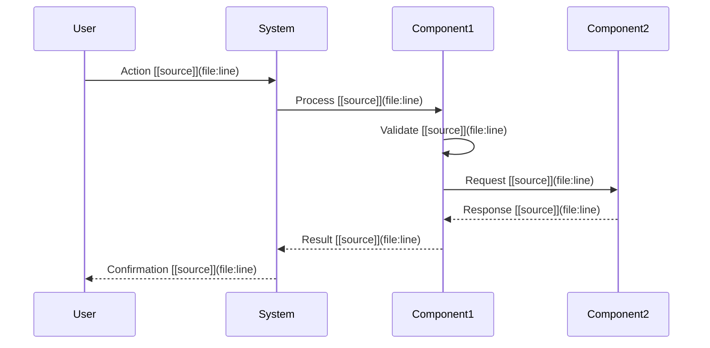

# Business Rules & Requirements: {PROJECT_NAME}

<!--
⚠️ CRITICAL CITATION REQUIREMENTS ⚠️

EVERY business rule, validation, workflow, and requirement MUST have an inline citation.
Business rules are implemented in code - cite where they're enforced.

WORKFLOW FOR WRITING THIS DOCUMENT:
1. Search for validation logic, business rule implementations, workflow code BEFORE writing
2. Gather all file paths and line numbers BEFORE writing prose
3. Write WITH citations inline - never describe a rule without citing its implementation
4. Use format: "Business rule [📄](path/to/validation:line)"
5. Validate every claim has a citation before moving to next section

WHAT NEEDS CITATIONS:
✅ Every business rule (cite validation method, middleware, or business logic)
✅ Every workflow step (cite controller method, state machine, or process handler)
✅ Every validation (cite validator class, validation middleware, or check function)
✅ Every state transition (cite state machine definition or transition logic)
✅ Every constraint (cite enforcement code, validator, or database constraint)
✅ Every use case (cite implementation controller/service methods)
✅ Every permission check (cite authorization middleware or permission logic)

GOOD EXAMPLE:
"Users must have valid email addresses [📄](src/validators/UserValidator.ts:45). Email validation [📄](src/validators/EmailValidator.ts:12) requires @ symbol and domain. Orders cannot be placed without inventory [📄](src/services/OrderService.ts:89)."

BAD EXAMPLE:
"Users must have valid email addresses. Orders cannot be placed without inventory."
↑ No citations - unacceptable

TEMPLATE INSTRUCTIONS:
- Replace {PROJECT_NAME} with actual project name
- Search for validation/business logic BEFORE writing each rule
- Cite every rule, validation, workflow with [📄](path/file:line)
- Document workflows based on actual implementation code
- NEVER describe a business rule without citing where it's enforced
- Do not confabulate - every claim must be verifiable from source code
-->

## Who Should Read This

This document is intended for:
- **Product Managers**: Understand functional capabilities and requirements
- **Business Analysts**: Document and validate business rules
- **Software Engineers**: Implement requirements correctly
- **QA Engineers**: Create test cases and acceptance criteria
- **Business Stakeholders**: Understand system capabilities and constraints

**Prerequisites**: Familiarity with {domain concepts}

**Reading Time**: 60-70 minutes

---

## Table of Contents

1. [Requirements Overview](#requirements-overview)
2. [Functional Requirements by Domain](#functional-requirements-by-domain)
3. [Business Rules & Validation](#business-rules--validation)
4. [User Workflows](#user-workflows)
5. [Compliance & Security Requirements](#compliance--security-requirements)
6. [Use Cases & User Stories](#use-cases--user-stories)
7. [Acceptance Criteria](#acceptance-criteria)
8. [Future Requirements & Roadmap](#future-requirements--roadmap)

---

## Requirements Overview

### Purpose of This Document

This document serves dual purposes:
1. **Requirements Specification**: What the system must do
2. **Business Rules Documentation**: How the system enforces business logic

### Requirement Categories

```mermaid
mindmap
  root(({PROJECT_NAME}<br/>Requirements))
    Functional
      {Domain 1}
      {Domain 2}
      {Domain 3}
    Integration
      {Integration Type 1}
      {Integration Type 2}
```

---

## Functional Requirements by Domain

<!-- DOMAIN ORDERING: Do NOT list domains in arbitrary or alphabetical order.
     Order by business process flow within this capability:
     1. Entry points / triggers first (e.g., claim ingestion, batch jobs, incoming requests)
     2. Processing stages in pipeline order (discovery → generation → filtering → pricing → selection)
     3. Consumer-facing output last (e.g., recommendations, API responses)
     4. Supporting sub-domains at the end (caching, auditing)
     See "Domain Ordering Strategy" in SKILL.md for full guidance. -->

## Domain {N}: {Domain Name} [[source]](file:line)

### FR-{DOMAIN}-001: {Requirement Name} [[source]](file:line)
**Description**: {Description of the requirement} [[source]](file:line)

**Requirements**:
- **FR-{DOMAIN}-001.1**: {Sub-requirement}[[source]](file:line)
- **FR-{DOMAIN}-001.2**: {Sub-requirement}[[source]](file:line)
- **FR-{DOMAIN}-001.3**: {Sub-requirement}[[source]](file:line)

<!-- Repeat for each functional requirement -->

---

## Business Rules & Validation

### BR-{N}: {Entity/Domain} Business Rules

| Rule ID | Description | Enforcement | Source |
|---------|-------------|-------------|--------|
| BR-{DOMAIN}-001 | {Rule description} | {Database constraint/Application logic/etc.} | [[source]](file:line) |
| BR-{DOMAIN}-002 | {Rule description} | {Enforcement mechanism} | [[source]](file:line) |
| BR-{DOMAIN}-003 | {Rule description} | {Enforcement mechanism} | [[source]](file:line) |

<!-- Repeat for each domain/entity -->

---

## User Workflows

### Workflow {N}: {Workflow Name} [[source]](file:line)



**Steps**:
1. {Step description} [[source]](file:line)
2. {Step description} [[source]](file:line)
3. {Step description} [[source]](file:line)

<!-- Repeat for other key workflows -->

---

## Compliance & Security Requirements

### {Regulation/Standard Name}

**Requirements**:
- **{REQ-ID}**: {Requirement description} [[source]](file:line)
- **{REQ-ID}**: {Requirement description} [[source]](file:line)
- **{REQ-ID}**: {Requirement description} [[source]](file:line)

**Implementation**:
- {How the requirement is implemented} [[source]](file:line)

### Security Requirements

| Requirement | Description | Implementation | Source |
|-------------|-------------|----------------|--------|
| **{Requirement}** | {Description} | {How it's implemented} | [[source]](file:line) |
| **{Requirement}** | {Description} | {How it's implemented} | [[source]](file:line) |

### Data Privacy & Protection

**Requirements**:
- **{Requirement}**: {Description and implementation} [[source]](file:line)
- **{Requirement}**: {Description and implementation} [[source]](file:line)

---

## Use Cases & User Stories

### Use Case: {Use Case Name}

**Actor**: {Primary actor}
**Goal**: {User's goal}

**Preconditions**:
- {Precondition} [[source]](file:line)
- {Precondition} [[source]](file:line)

**Main Flow**:
1. {Step} [[source]](file:line)
2. {Step} [[source]](file:line)
3. {Step} [[source]](file:line)

**Postconditions**:
- {Postcondition} [[source]](file:line)
- {Postcondition} [[source]](file:line)

**Alternative Flows**:
- {Alternative scenario} [[source]](file:line)

### User Story: {Story Name}

**As a** {user type},
**I want to** {action},
**So that** {benefit}.

**Acceptance Criteria**:
- [ ] {Criterion} [[source]](file:line)
- [ ] {Criterion} [[source]](file:line)
- [ ] {Criterion} [[source]](file:line)

<!-- Repeat for other use cases, user stories, and features -->

---

## Additional Source Code References

<!-- Add actual source code references -->
**[1]** {Description}: [{file-path}]({file-path}) (Lines {start}-{end})

---

## Related Documents

- [System Architecture](01-SYSTEM-ARCHITECTURE.md)
- [Data Model & Relationships](02-DATA-MODEL-AND-RELATIONSHIPS.md)
- [Integration & API Guide](04-INTEGRATION-AND-API-GUIDE.md)
- [Quick Reference](05-QUICK-REFERENCE.md)

---

*Generated By LegacyLift AI by CapTech*
*Generated on: {GENERATED_DATE}*
