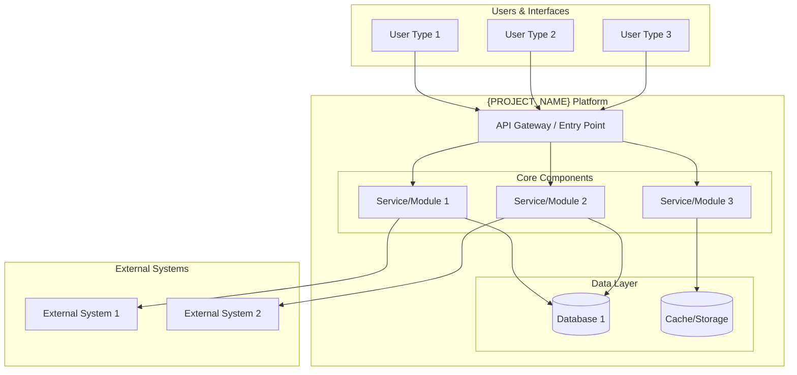
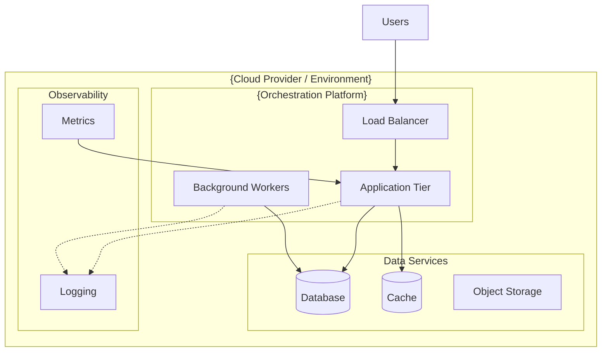
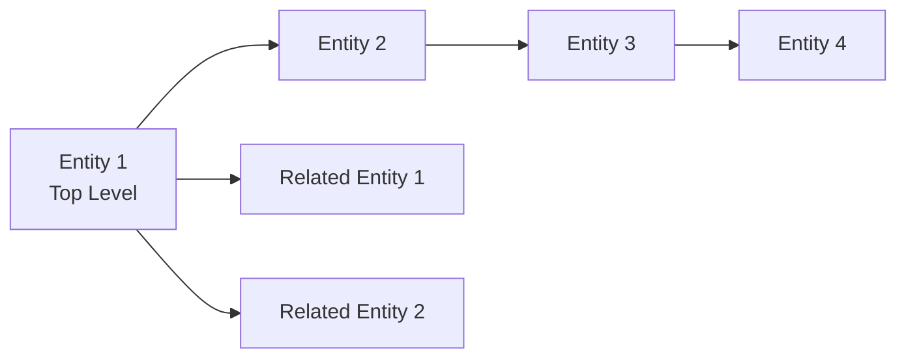

# {PROJECT_NAME}: Executive Summary

<!--
⚠️ CRITICAL CITATION REQUIREMENTS ⚠️

EVERY substantive claim in this document MUST have an inline citation to source code.
Citations are NOT optional - they prove the document's veracity and build trust.

WORKFLOW FOR WRITING THIS DOCUMENT:
1. For each section, FIRST search for source code evidence using Task/Explore agents
2. Gather all file paths and line numbers BEFORE writing prose
3. Write WITH citations inline - never write a sentence without its citation
4. Use format: "claim text [📄](path/to/file.ext:line)"
5. Validate every claim has a citation before moving to the next section

WHAT NEEDS CITATIONS:
✅ Every technology mentioned (cite config files, package.json, imports)
✅ Every service/component mentioned (cite service class, controller)
✅ Every feature capability (cite implementation method, API endpoint)
✅ Every data entity (cite model class, schema file)
✅ Architectural patterns (cite middleware, service boundaries, infrastructure code)
✅ Integration points (cite client classes, API calls, external service configs)

GOOD EXAMPLE:
"The system uses PostgreSQL [📄](src/db/config.ts:12) for data persistence and Redis [📄](src/cache/redis-client.ts:8) for caching."

BAD EXAMPLE:
"The system uses PostgreSQL for data persistence and Redis for caching."
↑ No citations - this is unacceptable

TEMPLATE INSTRUCTIONS:
- Replace {PROJECT_NAME} with the actual project/system name
- Fill in all sections with project-specific content
- Search for evidence BEFORE writing each section
- Include inline citations with every claim using format [📄](path/file:line)
- Customize reading times based on actual content length
- Replace example diagrams with actual system diagrams
- NEVER write placeholder text without citations
- Do not confabulate - every claim must be verifiable from source code
-->

## Who Should Read This

This document is designed for **all stakeholders**:
- **Executives & Business Leaders**: Understand what {PROJECT_NAME} does and its business value
- **Product Managers**: Learn system capabilities and roadmap context
- **New Engineers**: Get oriented quickly with the system's purpose and structure
- **Architects & Technical Leaders**: High-level technical overview and navigation to detailed docs
- **External Partners**: Understand integration opportunities and system boundaries

**Reading Time**: 15-20 minutes

---

## Table of Contents

1. [What is {PROJECT_NAME}?](#what-is-project-name)
2. [System Overview](#system-overview)
3. [Core Capabilities](#core-capabilities)
4. [Codebase Metrics](#codebase-metrics)
5. [High-Level Architecture](#high-level-architecture)
6. [Technology Stack](#technology-stack)
7. [Key Data Concepts](#key-data-concepts)
8. [Business Value](#business-value)
9. [Document Navigation Guide](#document-navigation-guide)

---

## What is {PROJECT_NAME}?

<!-- Provide a 2-3 paragraph description of the system -->

<!-- WORKFLOW: Search for project description evidence (README, main service files, package.json) BEFORE writing -->
**{PROJECT_NAME}** is {brief description of what the system does and its primary purpose} [📄](path/to/main-entry-point:line).

### Purpose

<!-- WORKFLOW: Search for each capability's implementation BEFORE listing -->
{PROJECT_NAME} enables {target users} to:
- **{Key capability 1}** [📄](path/to/implementation:line): {brief description}
- **{Key capability 2}** [📄](path/to/implementation:line): {brief description}
- **{Key capability 3}** [📄](path/to/implementation:line): {brief description}
- **{Key capability 4}** [📄](path/to/implementation:line): {brief description}

---

## System Overview

### Architectural Style

<!-- WORKFLOW: Search for architectural evidence (service structure, middleware, deployment configs) BEFORE writing -->
- **{Architecture Pattern}** [📄](path/to/evidence:line): {Brief explanation}
- **{Key Pattern 2}** [📄](path/to/evidence:line): {Brief explanation}
- **{Key Pattern 3}** [📄](path/to/evidence:line): {Brief explanation}
- **{Deployment Strategy}** [📄](path/to/deployment-config:line): {Brief explanation}

---

## Core Capabilities

<!-- WORKFLOW: For each capability area, search for implementations BEFORE writing -->

### 1. {Capability Area 1}
- **{Feature 1}** [📄](path/to/controller-or-service:line): {Brief description}
- **{Feature 2}** [📄](path/to/controller-or-service:line): {Brief description}
- **{Feature 3}** [📄](path/to/controller-or-service:line): {Brief description}

### 2. {Capability Area 2}
- **{Feature 1}** [📄](path/to/controller-or-service:line): {Brief description}
- **{Feature 2}** [📄](path/to/controller-or-service:line): {Brief description}
- **{Feature 3}** [📄](path/to/controller-or-service:line): {Brief description}

### 3. {Capability Area 3}
- **{Feature 1}** [📄](path/to/controller-or-service:line): {Brief description}
- **{Feature 2}** [📄](path/to/controller-or-service:line): {Brief description}
- **{Feature 3}** [📄](path/to/controller-or-service:line): {Brief description}

<!-- Add more capability areas as needed -->

---

## Codebase Metrics

<!-- WORKFLOW: Generate codebase metrics during Phase 1 (Initial Discovery) -->
<!-- Use find + wc commands to count lines of code by file type -->
<!-- Exclude: build artifacts (.gradle, build/, target/), dependencies (node_modules/), documentation (legacylift-docs/) -->
<!-- Include: source files (.java, .js, .py, .cs, .sql, .xml, .jsp, .tsx, .ts, etc.) -->

**Total Lines of Code: {TOTAL_LOC}**

Across **{TOTAL_FILES} files**

### Breakdown by File Type:

| File Type | Lines of Code | Number of Files | Percentage |
|-----------|--------------|-----------------|------------|
| {.ext1} | {lines1} | {files1} | {pct1}% |
| {.ext2} | {lines2} | {files2} | {pct2}% |
| {.ext3} | {lines3} | {files3} | {pct3}% |
| {.ext4} | {lines4} | {files4} | {pct4}% |
| {.ext5} | {lines5} | {files5} | {pct5}% |
<!-- Add more file types as found in codebase -->

### Key Observations:

<!-- WORKFLOW: Analyze the breakdown to generate insights -->
- **{Primary Language}** is the dominant language ({X}K lines, {Y}% of codebase), representing {role in architecture}
- **{Secondary Language}** makes up {X}% of the codebase ({Y}K lines), indicating {purpose/role}
- **{Database/Schema files}** comprise {X}% ({Y}K lines across {N} files), {description of database layer}
- {Additional observations about codebase composition}
- {Architectural insights from file type distribution}
- {Technology stack indicators from file extensions}

---

## High-Level Architecture

### {Primary Architectural Decomposition}

<!-- WORKFLOW: Search for all services/components BEFORE writing this table -->
{PROJECT_NAME} is composed of **{N} core {components/services/modules}**, each responsible for a specific domain:

| Component | Responsibility | Key Features |
|-----------|---------------|--------------|
| **{Component 1}** [📄](path/to/service-or-module:line) | {Primary purpose} | {Key features} |
| **{Component 2}** [📄](path/to/service-or-module:line) | {Primary purpose} | {Key features} |
| **{Component 3}** [📄](path/to/service-or-module:line) | {Primary purpose} | {Key features} |
<!-- Add more components with citations -->

See **[01-SYSTEM-ARCHITECTURE.md](../docs/01-SYSTEM-ARCHITECTURE.md)** for detailed component documentation.

### Deployment Architecture

### Key Architectural Principles

1. **{Principle 1}**: {Explanation and benefits}
2. **{Principle 2}**: {Explanation and benefits}
3. **{Principle 3}**: {Explanation and benefits}
4. **{Principle 4}**: {Explanation and benefits}
5. **{Principle 5}**: {Explanation and benefits}

---

## Technology Stack

<!-- WORKFLOW: Search for package.json, requirements.txt, go.mod, etc. BEFORE writing -->
<!-- WORKFLOW: Search for config files, startup files, imports BEFORE writing -->

### Backend
- **Language**: {Primary language(s)} [📄](package.json:line OR equivalent)
- **Framework**: {Web framework(s)} [📄](path/to/main-server-file:line)
- **{Key Technology}**: {Purpose and usage} [📄](path/to/config-or-usage:line)
- **{Key Technology}**: {Purpose and usage} [📄](path/to/config-or-usage:line)

### Data Layer
- **{Database Type}**: {Purpose and usage} [📄](path/to/db-config:line)
- **{Database Type}**: {Purpose and usage} [📄](path/to/db-config:line)
- **Caching**: {Technology and purpose} [📄](path/to/cache-config:line)
- **File Storage**: {Technology and purpose} [📄](path/to/storage-config:line)

### Infrastructure
- **Containers**: {Container technology} [📄](Dockerfile:line OR docker-compose.yml:line)
- **Orchestration**: {Orchestration platform} [📄](path/to/k8s-or-helm:line)
- **Deployment**: {Deployment tools} [📄](path/to/deploy-config:line)
- **CI/CD**: {CI/CD platform} [📄](.github/workflows/file.yml:line OR .gitlab-ci.yml:line)
- **Monitoring**: {Monitoring tools} [📄](path/to/monitoring-config:line)

### Frontend (if applicable)
- **Framework**: {Frontend framework} [📄](path/to/frontend/package.json:line)
- **{Technology}**: {Purpose} [📄](path/to/config:line)
- **{Technology}**: {Purpose} [📄](path/to/config:line)

### Integration
- **Authentication**: {Auth methods} [📄](path/to/auth-config-or-middleware:line)
- **{Integration Type}**: {Technologies} [📄](path/to/integration-client:line)
- **{Integration Type}**: {Technologies} [📄](path/to/integration-client:line)

See **[01-SYSTEM-ARCHITECTURE.md](../docs/01-SYSTEM-ARCHITECTURE.md)** for technology deep dive.

---

## Key Data Concepts

{PROJECT_NAME}'s data model is built around these core concepts:

### {Primary Data Hierarchy/Model}

### Key Entities

<!-- WORKFLOW: Search for model/entity classes BEFORE writing this table -->
| Entity | Purpose | Key Relationships |
|--------|---------|-------------------|
| **{Entity 1}** [📄](path/to/model-class:line) | {Purpose} | {Relationships} |
| **{Entity 2}** [📄](path/to/model-class:line) | {Purpose} | {Relationships} |
| **{Entity 3}** [📄](path/to/model-class:line) | {Purpose} | {Relationships} |
| **{Entity 4}** [📄](path/to/model-class:line) | {Purpose} | {Relationships} |
<!-- Add more entities with citations to their definitions -->

See **[02-DATA-MODEL-AND-RELATIONSHIPS.md](../docs/02-DATA-MODEL-AND-RELATIONSHIPS.md)** for complete data model.

---

## Business Value

### For {Stakeholder Group 1}
- **{Benefit 1}**: {Description and value}
- **{Benefit 2}**: {Description and value}
- **{Benefit 3}**: {Description and value}

### For {Stakeholder Group 2}
- **{Benefit 1}**: {Description and value}
- **{Benefit 2}**: {Description and value}
- **{Benefit 3}**: {Description and value}

### For {Stakeholder Group 3}
- **{Benefit 1}**: {Description and value}
- **{Benefit 2}**: {Description and value}
- **{Benefit 3}**: {Description and value}

---

## Document Navigation Guide

This documentation suite is designed for progressive disclosure. Start with the documents most relevant to your role, then dive deeper as needed.

### For New Engineers

**Recommended Reading Order:**
1. **You are here** → Executive Summary (this document)
2. **[01-SYSTEM-ARCHITECTURE.md](../docs/01-SYSTEM-ARCHITECTURE.md)** → Understand the technical architecture
3. **[02-DATA-MODEL-AND-RELATIONSHIPS.md](../docs/02-DATA-MODEL-AND-RELATIONSHIPS.md)** → Learn the core data model
4. **[05-QUICK-REFERENCE.md](../docs/05-QUICK-REFERENCE.md)** → Keep this handy for quick lookups
5. **[03-BUSINESS-RULES-AND-REQUIREMENTS.md](../docs/03-BUSINESS-RULES-AND-REQUIREMENTS.md)** → Understand functional requirements
6. **[04-INTEGRATION-AND-API-GUIDE.md](../docs/04-INTEGRATION-AND-API-GUIDE.md)** → Learn integration patterns

### For Product/Business Stakeholders

**Recommended Reading Order:**
1. **You are here** → Executive Summary (this document)
2. **[03-BUSINESS-RULES-AND-REQUIREMENTS.md](../docs/03-BUSINESS-RULES-AND-REQUIREMENTS.md)** → Functional capabilities and use cases
3. **[02-DATA-MODEL-AND-RELATIONSHIPS.md](../docs/02-DATA-MODEL-AND-RELATIONSHIPS.md)** → Core concepts (skip technical details)
4. **[01-SYSTEM-ARCHITECTURE.md](../docs/01-SYSTEM-ARCHITECTURE.md)** → High-level architecture only

### For Technical Architects

**Recommended Reading Order:**
1. **You are here** → Executive Summary (this document)
2. **[01-SYSTEM-ARCHITECTURE.md](../docs/01-SYSTEM-ARCHITECTURE.md)** → Deep dive on architecture
3. **[04-INTEGRATION-AND-API-GUIDE.md](../docs/04-INTEGRATION-AND-API-GUIDE.md)** → Integration patterns
4. **[02-DATA-MODEL-AND-RELATIONSHIPS.md](../docs/02-DATA-MODEL-AND-RELATIONSHIPS.md)** → Data architecture
5. **[03-BUSINESS-RULES-AND-REQUIREMENTS.md](../docs/03-BUSINESS-RULES-AND-REQUIREMENTS.md)** → Non-functional requirements

### For Integration Partners

**Recommended Reading Order:**
1. **You are here** → Executive Summary (this document)
2. **[04-INTEGRATION-AND-API-GUIDE.md](../docs/04-INTEGRATION-AND-API-GUIDE.md)** → API documentation and patterns
3. **[02-DATA-MODEL-AND-RELATIONSHIPS.md](../docs/02-DATA-MODEL-AND-RELATIONSHIPS.md)** → Understanding data entities
4. **[05-QUICK-REFERENCE.md](../docs/05-QUICK-REFERENCE.md)** → API quick reference

### Document Summary Table

| Document | Purpose | Audience | Est. Reading Time |
|----------|---------|----------|-------------------|
| **00-EXECUTIVE-SUMMARY.md** | High-level overview and navigation | Everyone | 15-20 min |
| **01-SYSTEM-ARCHITECTURE.md** | Technical architecture deep dive | Engineers, Architects | 45-60 min |
| **02-DATA-MODEL-AND-RELATIONSHIPS.md** | Core data concepts and relationships | Engineers, Architects, PM | 50-60 min |
| **03-BUSINESS-RULES-AND-REQUIREMENTS.md** | Functional and non-functional requirements | PM, Business, Engineers | 60-70 min |
| **04-INTEGRATION-AND-API-GUIDE.md** | API and integration patterns | Engineers, Partners | 40-50 min |
| **05-QUICK-REFERENCE.md** | Glossary and quick lookups | Everyone | 10-15 min |

---

## Quick Links

- [System Architecture](../docs/01-SYSTEM-ARCHITECTURE.md)
- [Data Model & Relationships](../docs/02-DATA-MODEL-AND-RELATIONSHIPS.md)
- [Business Rules & Requirements](../docs/03-BUSINESS-RULES-AND-REQUIREMENTS.md)
- [Integration & API Guide](../docs/04-INTEGRATION-AND-API-GUIDE.md)
- [Quick Reference](../docs/05-QUICK-REFERENCE.md)

---

*Generated By LegacyLift AI by CapTech*
*Generated on: {GENERATED_DATE}*