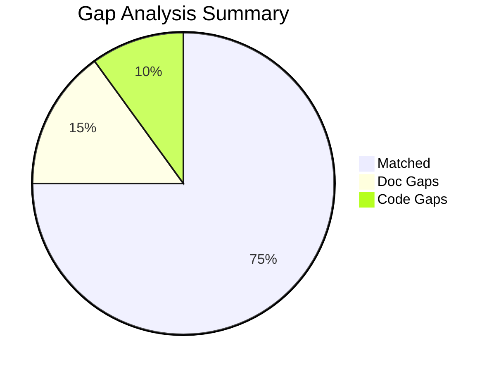
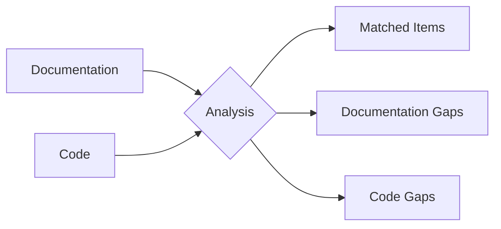

## Overview

This skill performs a comprehensive gap analysis between documentation and code implementation for any codebase. It dynamically discovers patterns, extracts defined items from documentation, scans code for implementations, and generates a detailed report highlighting discrepancies.

## Usage

```
/legacylift-classic:gap-analyzer docs_path=<path> code_path=<path> output_dir=<path>
```

### Parameters

| Parameter | Required | Default | Description |
|-----------|----------|---------|-------------|
| `docs_path` | No | Auto-detect | Path to documentation folder (tries: `TXT/`, `docs/`, `documentation/`, `legacylift-docs/`) |
| `code_path` | No | Current working directory | Path to the code repository |
| `output_dir` | No | `{code_path}/legacylift-docs/` | Where to write the gap analysis report |

### Examples

```bash
# Analyze with explicit paths
/legacylift-classic:gap-analyzer docs_path=repos/my_project/TXT code_path=repos/my_project

# Auto-detect documentation folder in current project
/legacylift-classic:gap-analyzer code_path=repos/my_project

# Use all defaults (current directory)
/legacylift-classic:gap-analyzer
```

---

## Execution Guidelines: Persistence and Autonomy

**Your context window will be automatically compacted as it approaches its limit, allowing you to continue working indefinitely from where you left off. Therefore, do not stop tasks early due to token budget concerns.**

**Critical Requirements:**
- As you approach your token budget limit, save your current progress and state to memory before the context window refreshes
- Always be as persistent and autonomous as possible
- Complete tasks fully, even if the end of your budget is approaching
- Never artificially stop any task early regardless of the context remaining
- If context compaction occurs, resume exactly where you left off using incremental writing patterns
- Use markers like `<!-- MORE CONTENT TO FOLLOW -->` to enable seamless continuation after context refresh

**Handling Context Compaction:**
1. Document current progress in todo list
2. Ensure continuation markers are present in documents
3. After refresh, read documents to determine last completed section
4. Continue with next section/phase
5. Maintain same format and quality standards throughout

---

## Analysis Workflow

Execute these 7 phases sequentially. Use the TodoWrite tool to track progress through each phase.

### Phase 0: Load Fact Graph (if available)

<status-update required="true">
**⚠️ MANDATORY STATUS UPDATE:** Before starting this phase, you MUST run:
```bash
STATUS_FILE="${SKILL_STATUS_FILE:-/home/node/skill-status/current.json}"
echo '{"phase": "Load Fact Graph", "phase_number": 0, "total_phases": 6, "progress_percent": 0, "current_task": "Loading fact graph", "last_updated": "'$(date -u +%Y-%m-%dT%H:%M:%SZ)'"}' > "$STATUS_FILE"
```
</status-update>

**Objective**: Check for and load pre-generated fact graph to use as complete code inventory.

**Canonical Reference**: See [FACT-GRAPH-INTEGRATION.md](../FACT-GRAPH-INTEGRATION.md) for the complete Phase 0 specification shared across all skills.

**⚠️ Domain-Scoped Packs**: The fact-graph skill generates domain-scoped pack files (e.g., `core.entities.pack.json`, `points.entities.pack.json`).

```python
import os
import json
from pathlib import Path

# Check if fact graph exists
fact_graph_path = 'legacylift-docs/context/index.json'
fact_graph_loaded = False
entities = []
relations = []
facts = []
index_metadata = {}
statistics = {}
packs_metadata = []

if os.path.exists(fact_graph_path):
    try:
        # Load index
        with open(fact_graph_path) as f:
            index = json.load(f)
            index_metadata = index.get('metadata', {})
            statistics = index.get('statistics', {})
            packs_metadata = statistics.get('packs_metadata', [])

        # Load all domain-scoped pack files
        packs_dir = Path('legacylift-docs/context/packs')

        if packs_dir.exists():
            # Load entities from all domain packs
            for pack_file in sorted(packs_dir.glob('*.entities.pack.json')):
                with open(pack_file) as f:
                    pack_data = json.load(f)
                    domain_entities = pack_data.get('entities', [])
                    entities.extend(domain_entities)
                    print(f"   Loaded {len(domain_entities)} entities from {pack_file.name}")

            # Load relations from all domain packs
            for pack_file in sorted(packs_dir.glob('*.relations.pack.json')):
                with open(pack_file) as f:
                    pack_data = json.load(f)
                    domain_relations = pack_data.get('relations', [])
                    relations.extend(domain_relations)
                    print(f"   Loaded {len(domain_relations)} relations from {pack_file.name}")

            # Load facts from all domain packs
            for pack_file in sorted(packs_dir.glob('*.facts.pack.json')):
                with open(pack_file) as f:
                    pack_data = json.load(f)
                    domain_facts = pack_data.get('facts', [])
                    facts.extend(domain_facts)
                    print(f"   Loaded {len(domain_facts)} facts from {pack_file.name}")

        fact_graph_loaded = True
        print(f"\n✅ Loaded fact graph: {len(entities)} entities, {len(relations)} relations, {len(facts)} facts")
        print(f"   Domains: {len(packs_metadata)}")
        for pack in packs_metadata:
            print(f"   - {pack['domain']}: {pack['entity_count']} entities, {pack['relation_count']} relations, {pack['fact_count']} facts")
    except Exception as e:
        print(f"⚠️ Failed to load fact graph: {e}")
        print("   Falling back to direct code analysis")
        fact_graph_loaded = False
else:
    print("ℹ️ No fact graph found, using direct code analysis")

# Helper functions for querying fact graph
def find_entities_by_type(entity_type):
    """Find all entities of a given type"""
    return [e for e in entities if e['type'] == entity_type]

def find_entity_by_name(name):
    """Find entity by exact name match"""
    return next((e for e in entities if e['name'] == name), None)

def get_entity_by_id(entity_id):
    """Get entity by ID"""
    return next((e for e in entities if e['id'] == entity_id), None)

def build_code_inventory():
    """Build complete code inventory from fact-graph entities"""
    inventory = {}

    # Group entities by category
    for entity in entities:
        category = entity['type']  # class, interface, function, endpoint, table, etc.
        name = entity['name']
        file_path = entity['file']
        line_range = entity.get('line_range', [0, 0])

        if category not in inventory:
            inventory[category] = []

        inventory[category].append({
            'id': entity['id'],
            'name': name,
            'file': file_path,
            'line': line_range[0],
            'line_range': line_range,
            'entity': entity
        })

    return inventory
```

**Usage in Phase 3 (Code Analysis):**

When fact-graph is loaded, use it as the complete code inventory instead of grep/glob:

```python
if fact_graph_loaded:
    # Build complete inventory from fact-graph
    code_inventory = build_code_inventory()

    # All code items are now available organized by type
    all_code_items = {
        'classes': find_entities_by_type('class'),
        'interfaces': find_entities_by_type('interface'),
        'functions': find_entities_by_type('function'),
        'methods': find_entities_by_type('method'),
        'endpoints': find_entities_by_type('endpoint'),
        'tables': find_entities_by_type('table'),
        'stored_procs': find_entities_by_type('stored_proc'),
        'constants': [e for e in entities if e.get('attributes', {}).get('is_constant')],
        # ... other entity types
    }

    # Fast lookup for cross-referencing with documented items
    entities_by_name = {e['name']: e for e in entities}

    print(f"✅ Using fact-graph for code inventory:")
    print(f"   Total entities: {len(entities)}")
    for entity_type, entity_list in all_code_items.items():
        if entity_list:
            print(f"   - {entity_type}: {len(entity_list)}")
else:
    # Fallback to grep/glob for code analysis (original Phase 3 logic)
    print("ℹ️ Fact-graph not available, using grep/glob for code analysis")
    # ... original grep/glob code scanning ...
```

**Benefits:**
- ✅ Complete code inventory instantly available (no grep/glob needed)
- ✅ Deterministic entity identification with unique IDs
- ✅ File paths and line numbers already extracted for citations
- ✅ Fast cross-referencing: O(1) lookup vs O(N) grep searches
- ✅ Consistent entity naming across all gap detection
- ✅ Eliminates false positives from grep pattern matching

---

### Phase 1: Discovery

<status-update required="true">
**⚠️ MANDATORY STATUS UPDATE:** Before starting this phase, you MUST run:
```bash
STATUS_FILE="${SKILL_STATUS_FILE:-/home/node/skill-status/current.json}"
echo '{"phase": "Discovery", "phase_number": 1, "total_phases": 6, "progress_percent": 16, "current_task": "Discovering documentation and code files", "last_updated": "'$(date -u +%Y-%m-%dT%H:%M:%SZ)'"}' > "$STATUS_FILE"
```
</status-update>

**Objective**: Identify all documentation and code files to analyze.

#### 1.1 Locate Documentation

```
IF docs_path is provided:
    Use docs_path directly
ELSE:
    Search for common documentation folders in order:
    1. {code_path}/TXT/
    2. {code_path}/docs/
    3. {code_path}/documentation/
    4. {code_path}/legacylift-docs/
    5. {code_path}/*.md (root markdown files)
```

#### 1.2 Catalog Documentation Files

Use Glob to find all documentation files:
- `**/*.txt` - Text documentation
- `**/*.md` - Markdown documentation
- `**/*.rst` - ReStructuredText
- `**/*.adoc` - AsciiDoc

Record each file with:
- File path
- File type
- Approximate line count

#### 1.3 Catalog Code Files

Use Glob to find all code files:
- `**/*.py` - Python
- `**/*.sql` - SQL
- `**/*.scala` - Scala
- `**/*.java` - Java
- `**/*.js` / `**/*.ts` - JavaScript/TypeScript
- `**/*.ipynb` - Jupyter notebooks
- `**/*.sh` - Shell scripts

Exclude common non-code directories:
- `node_modules/`
- `venv/` / `.venv/`
- `__pycache__/`
- `.git/`
- `build/` / `dist/`

#### 1.4 Discovery Output

Create a summary:
```
Documentation Files Found: X
- TXT files: N
- MD files: N
- Other: N

Code Files Found: Y
- Python: N
- SQL: N
- Notebooks: N
- Other: N
```

---

### Phase 2: Documentation Extraction

<status-update required="true">
**⚠️ MANDATORY STATUS UPDATE:** Before starting this phase, you MUST run:
```bash
STATUS_FILE="${SKILL_STATUS_FILE:-/home/node/skill-status/current.json}"
echo '{"phase": "Documentation Extraction", "phase_number": 2, "total_phases": 6, "progress_percent": 33, "current_task": "Extracting documented items", "last_updated": "'$(date -u +%Y-%m-%dT%H:%M:%SZ)'"}' > "$STATUS_FILE"
```
</status-update>

**Objective**: Parse documentation to extract all defined features, codes, parameters, and specifications.

#### 2.1 Pattern Categories to Extract

For each documentation file, search for and extract:

**A. Codes and Identifiers**
- Revert codes (e.g., `REVERT_001`, `REV-XXX`)
- Delete codes (e.g., `DELETE_001`, `DEL-XXX`)
- Error codes (e.g., `ERR_001`, `E-XXX`)
- Status codes (e.g., `STATUS_ACTIVE`, `ST_XXX`)
- Any alphanumeric codes with patterns like `XXX_NNN` or `XXX-NNN`

**B. Parameters and Configurations**
- Widget parameters (Databricks: `dbutils.widgets`)
- Environment variables
- Configuration keys
- Feature flags

**C. Functions and Procedures**
- Function definitions mentioned in docs
- Stored procedures
- API endpoints
- SQL procedures/functions

**D. Business Rules**
- Conditional logic descriptions
- Validation rules
- Calculation formulas
- Threshold values

**E. Data Elements**
- Table names
- Column names
- Field mappings
- Data types specified

#### 2.2 Extraction Strategy

For each documentation file:

1. **Read the file** using the Read tool
2. **Identify document type** (technical spec, requirements, data dictionary, etc.)
3. **Apply pattern matching**:
   - Use regex patterns to find codes: `[A-Z]+[_-][A-Z0-9]+`
   - Look for definition lists, tables, bullet points
   - Extract items from headers and sections
4. **Record findings** with:
   - Item name/identifier
   - Category (code, parameter, function, etc.)
   - Source file and line number
   - Description/context if available

#### 2.3 Documentation Extraction Output

Build a structured list:
```
DOCUMENTED ITEMS:
| ID | Category | Item Name | Source File | Line | Description |
|----|----------|-----------|-------------|------|-------------|
| D1 | Code | REVERT_001 | spec.txt | 45 | Reverts transaction |
| D2 | Param | start_date | config.md | 12 | Processing start |
...
```

---

### Phase 3: Code Analysis

<status-update required="true">
**⚠️ MANDATORY STATUS UPDATE:** Before starting this phase, you MUST run:
```bash
STATUS_FILE="${SKILL_STATUS_FILE:-/home/node/skill-status/current.json}"
echo '{"phase": "Code Analysis", "phase_number": 3, "total_phases": 6, "progress_percent": 50, "current_task": "Analyzing codebase", "last_updated": "'$(date -u +%Y-%m-%dT%H:%M:%SZ)'"}' > "$STATUS_FILE"
```
</status-update>

**Objective**: Scan codebase for implemented features, codes, parameters, and constructs.

**⚠️ IMPORTANT**: If fact-graph was loaded in Phase 0, use it as the complete code inventory instead of grep/glob. The fact-graph provides a comprehensive, deterministic list of all code entities with file paths and line numbers.

```python
if fact_graph_loaded:
    # USE FACT-GRAPH AS CODE INVENTORY
    print("✅ Using fact-graph for complete code inventory")

    # Build structured inventory from entities
    code_inventory = {
        'IMPLEMENTED_ITEMS': []
    }

    # Extract all entity types
    for entity in entities:
        item = {
            'id': len(code_inventory['IMPLEMENTED_ITEMS']) + 1,
            'category': entity['type'],  # class, function, endpoint, table, etc.
            'item_name': entity['name'],
            'source_file': entity['file'],
            'line': entity.get('line_range', [0, 0])[0],
            'details': f"{entity['type']} definition",
            'entity_id': entity['id']
        }
        code_inventory['IMPLEMENTED_ITEMS'].append(item)

    # Build fast lookup dictionary for cross-referencing
    entities_by_name = {e['name'].lower(): e for e in entities}

    print(f"   Total code items from fact-graph: {len(code_inventory['IMPLEMENTED_ITEMS'])}")
    print(f"   Categories: {len(set(e['type'] for e in entities))}")

    # SKIP grep/glob - fact-graph is already comprehensive
    # Proceed directly to Phase 4 (Gap Detection)

else:
    # FALLBACK: Use grep/glob for code analysis
    print("ℹ️ Fact-graph not available, falling back to grep/glob")
    # ... continue with original grep/glob logic below ...
```

#### 3.1 Code Pattern Categories (FALLBACK - only if fact-graph not available)

Search for implementations of:

**A. Constants and Codes**
```python
# Python patterns
CODE_NAME = "value"
REVERT_CODES = [...]
ERROR_MAP = {...}
```
```sql
-- SQL patterns
CASE WHEN code = 'XXX' THEN ...
WHERE status IN ('CODE1', 'CODE2')
```

**B. Parameters and Widgets**
```python
# Databricks widgets
dbutils.widgets.text("param_name", "default")
dbutils.widgets.dropdown(...)
dbutils.widgets.get("param_name")
```
```python
# Environment variables
os.getenv("VAR_NAME")
os.environ["VAR_NAME"]
```

**C. Functions and Methods**
```python
def function_name(...):
class ClassName:
    def method_name(...):
```
```sql
CREATE PROCEDURE proc_name
CREATE FUNCTION func_name
```

**D. SQL Objects**
```sql
CREATE TABLE table_name
INSERT INTO table_name
SELECT ... FROM table_name
```

**E. Business Logic Markers**
```python
# Comments indicating business rules
# RULE: description
# TODO: item
# FIXME: issue
```

#### 3.2 Analysis Strategy

For each code file:

1. **Read the file** using the Read tool
2. **Identify file type** and select appropriate patterns
3. **Extract constructs**:
   - Use Grep for pattern matching across files
   - Parse function/class definitions
   - Find string literals matching code patterns
4. **Record findings** with:
   - Item name/identifier
   - Category
   - Source file and line number
   - Implementation details

#### 3.3 Special Handling by File Type

**Python Files (.py)**:
- Extract all function definitions: `def \w+\(`
- Extract class definitions: `class \w+`
- Find widget usage: `dbutils.widgets`
- Find constant assignments: `^[A-Z_]+ = `

**SQL Files (.sql)**:
- Extract procedure/function definitions
- Find table references
- Extract CASE/WHEN conditions with codes

**Jupyter Notebooks (.ipynb)**:
- Parse each cell
- Apply Python patterns to code cells
- Check markdown cells for documentation

#### 3.4 Code Analysis Output

Build a structured list:
```
IMPLEMENTED ITEMS:
| ID | Category | Item Name | Source File | Line | Details |
|----|----------|-----------|-------------|------|---------|
| C1 | Code | REVERT_001 | main.py | 123 | In CODES dict |
| C2 | Param | start_date | notebook.py | 45 | Widget defined |
...
```

---

### Phase 4: Gap Detection

<status-update required="true">
**⚠️ MANDATORY STATUS UPDATE:** Before starting this phase, you MUST run:
```bash
STATUS_FILE="${SKILL_STATUS_FILE:-/home/node/skill-status/current.json}"
echo '{"phase": "Gap Detection", "phase_number": 4, "total_phases": 6, "progress_percent": 66, "current_task": "Detecting gaps between docs and code", "last_updated": "'$(date -u +%Y-%m-%dT%H:%M:%SZ)'"}' > "$STATUS_FILE"
```
</status-update>

**Objective**: Cross-reference documentation and code to identify discrepancies.

#### 4.1 Gap Categories

**Category 1: Documentation Gaps (Documented but NOT Implemented)**
- Items defined in documentation but not found in code
- May indicate: missing implementation, deprecated features, or planned features

**Category 2: Code Gaps (Implemented but NOT Documented)**
- Items found in code but not in documentation
- May indicate: undocumented features, tech debt, or documentation lag

**Category 3: Partial Matches**
- Items that exist in both but with discrepancies:
  - Different naming conventions
  - Partial implementations
  - Mismatched specifications

#### 4.2 Cross-Reference Algorithm

**If fact-graph loaded (FAST PATH):**

```python
if fact_graph_loaded:
    # O(1) lookup using entities_by_name dictionary
    matched = []
    documentation_gaps = []
    code_gaps = []

    # Check each documented item against fact-graph
    for doc_item in DOCUMENTED_ITEMS:
        item_name_normalized = doc_item['name'].lower()

        # Fast lookup in fact-graph
        if item_name_normalized in entities_by_name:
            entity = entities_by_name[item_name_normalized]
            matched.append({
                'doc_item': doc_item,
                'code_entity': entity,
                'file': entity['file'],
                'line': entity.get('line_range', [0, 0])[0]
            })
        else:
            # Try partial matches (e.g., normalized, pattern matching)
            partial_match = find_partial_match(item_name_normalized, entities_by_name)
            if partial_match:
                matched.append({
                    'doc_item': doc_item,
                    'code_entity': partial_match,
                    'match_type': 'partial'
                })
            else:
                documentation_gaps.append(doc_item)

    # Find code entities not in documentation
    matched_entity_ids = {m['code_entity']['id'] for m in matched}
    for entity in entities:
        if entity['id'] not in matched_entity_ids:
            code_gaps.append({
                'entity': entity,
                'name': entity['name'],
                'type': entity['type'],
                'file': entity['file'],
                'line': entity.get('line_range', [0, 0])[0]
            })

else:
    # FALLBACK: Nested loop comparison (slower)
    FOR each documented_item in DOCUMENTED_ITEMS:
        found = FALSE
        FOR each code_item in IMPLEMENTED_ITEMS:
            IF match(documented_item, code_item):
                Record as MATCHED
                Check for discrepancies
                found = TRUE
                BREAK
        IF NOT found:
            Record as DOCUMENTATION_GAP

    FOR each code_item in IMPLEMENTED_ITEMS:
        IF code_item NOT in MATCHED:
            Record as CODE_GAP
```

**Performance Comparison:**
- With fact-graph: O(N) where N = documented items (dictionary lookup)
- Without fact-graph: O(N * M) where N = documented items, M = code items (nested loops)

#### 4.3 Matching Rules

Items match if:
1. **Exact match**: Names are identical
2. **Normalized match**: Names match after normalization (case, underscores, hyphens)
3. **Pattern match**: Code pattern matches documented pattern (e.g., `REVERT_*`)
4. **Semantic match**: Similar purpose based on context analysis

#### 4.4 Priority Assignment

Assign priority to each gap:

| Priority | Criteria |
|----------|----------|
| CRITICAL | Core business logic, data integrity, security |
| HIGH | Key features, user-facing functionality |
| MEDIUM | Supporting features, internal tools |
| LOW | Nice-to-have, cosmetic, minor utilities |
| INFO | Informational only, no action needed |

#### 4.5 Gap Detection Output

```
DOCUMENTATION GAPS (Documented but not in code):
| Priority | Item | Category | Doc Source | Notes |
|----------|------|----------|------------|-------|
| HIGH | REVERT_005 | Code | spec.txt:67 | Not found in codebase |
...

CODE GAPS (In code but not documented):
| Priority | Item | Category | Code Source | Notes |
|----------|------|----------|-------------|-------|
| MEDIUM | helper_func | Function | utils.py:34 | Undocumented utility |
...
```

---

### Phase 5: Report Generation

<status-update required="true">
**⚠️ MANDATORY STATUS UPDATE:** Before starting this phase, you MUST run:
```bash
STATUS_FILE="${SKILL_STATUS_FILE:-/home/node/skill-status/current.json}"
echo '{"phase": "Report Generation", "phase_number": 5, "total_phases": 6, "progress_percent": 83, "current_task": "Generating gap analysis report", "last_updated": "'$(date -u +%Y-%m-%dT%H:%M:%SZ)'"}' > "$STATUS_FILE"
```
</status-update>

**Objective**: Generate the comprehensive markdown report.

#### 5.1 Report Structure

Use the template at `templates/10-GAP-ANALYSIS-REPORT.md` and fill in:

1. **Header**: Project name, date, version
2. **Executive Summary**: Key statistics and findings
3. **Part 1 - Documentation Gaps**: Items documented but not implemented
4. **Part 2 - Code Gaps**: Items implemented but not documented
5. **Part 3 - Cross-Reference**: Full mapping table
6. **Part 4 - Recommendations**: Prioritized action items
7. **Appendices**: File lists, methodology notes

#### 5.2 Citation Format

All findings must include citations:
```
| Item | Source | Line | Notes |
|------|--------|------|-------|
| REVERT_001 | `spec.txt` | 45 | "Reverts pending transactions" |
```

#### 5.3 Statistics to Calculate

```
Total Documentation Items: X
Total Code Items: Y
Matched Items: Z
Documentation Gaps: A (X - Z)
Code Gaps: B (Y - Z - known_exclusions)
Match Rate: Z / X * 100%

By Priority:
- CRITICAL: N
- HIGH: N
- MEDIUM: N
- LOW: N
- INFO: N
```

#### 5.4 Mermaid Diagrams

Include visual summaries:





---

### Phase 6: Output

<status-update required="true">
**⚠️ MANDATORY STATUS UPDATE:** Before starting this phase, you MUST run:
```bash
STATUS_FILE="${SKILL_STATUS_FILE:-/home/node/skill-status/current.json}"
echo '{"phase": "Output", "phase_number": 6, "total_phases": 6, "progress_percent": 95, "current_task": "Writing final report", "last_updated": "'$(date -u +%Y-%m-%dT%H:%M:%SZ)'"}' > "$STATUS_FILE"
```
</status-update>

**Objective**: Write the final report to the output directory.

#### 6.1 Output Files

Write to `{output_dir}/10-GAP-ANALYSIS-REPORT.md`

#### 6.2 Final Checklist

Before completing, verify:
- [ ] All sections of template are filled
- [ ] All citations point to valid files
- [ ] Statistics are accurate
- [ ] Tables are properly formatted
- [ ] Mermaid diagrams render correctly
- [ ] Recommendations are actionable
- [ ] Document ends with footer: `---\n\n*Generated By LegacyLift AI by CapTech*`

#### 6.3 Completion Message

```
Gap Analysis Complete!

Report written to: {output_dir}/10-GAP-ANALYSIS-REPORT.md

Summary:
- Documentation Items: X
- Code Items: Y
- Gaps Found: Z
- Match Rate: N%

Next Steps:
1. Review the report
2. Address CRITICAL and HIGH priority gaps
3. (Optional) Generate Excel report for stakeholder distribution
```

---

## Customization Notes

### Adapting for Different Codebases

This skill is designed to work with any codebase. When analyzing a new project:

1. **Adjust file patterns** in Phase 1 based on the tech stack
2. **Customize code patterns** in Phase 3 for project-specific conventions
3. **Modify priority criteria** in Phase 4 based on project context
4. **Update template sections** if project requires different report structure

### Common Customizations

**For Databricks Projects**:
- Focus on widget parameters
- Look for `dbutils.widgets.*` patterns
- Check notebook cells for magic commands

**For API Projects**:
- Focus on endpoint definitions
- Match routes to documentation
- Check request/response schemas

**For Data Pipeline Projects**:
- Focus on table and column definitions
- Match ETL steps to documentation
- Verify data transformations

---

## Error Handling

If issues occur during analysis:

1. **Missing docs folder**: Report which paths were checked, ask user to specify
2. **No code files found**: Verify code_path is correct
3. **Parse errors**: Log the file and continue with other files
4. **Large files**: Process in chunks, summarize findings

---

## Supporting Files & Templates

This skill uses supporting files in the `templates/` directory to ensure consistent, high-quality documentation output.

### Template Structure

| Template File | Purpose | Usage |
|---------------|---------|-------|
| **[10-GAP-ANALYSIS-REPORT.md](./templates/10-GAP-ANALYSIS-REPORT.md)** | Structure for gap analysis report | Guides comprehensive gap detection between documentation and code |

### LegacyLift Documentation Ecosystem

This skill is part of the comprehensive LegacyLift documentation suite. Here's the complete set of documents available:

| Prefix | Document | Generated By | Description |
|--------|----------|--------------|-------------|
| **Core Documentation Suite** ||||
| 00 | EXECUTIVE-SUMMARY | exec-summary-generator | High-level overview for all stakeholders |
| 01 | SYSTEM-ARCHITECTURE | si-documenter | Technical architecture deep dive |
| 02 | DATA-MODEL-AND-RELATIONSHIPS | data-documenter, database-layer-documenter | Data structures and relationships |
| 03 | BUSINESS-RULES-AND-REQUIREMENTS | business-documenter, detailed-req-documenter | Functional requirements and rules |
| 04 | INTEGRATION-AND-API-GUIDE | si-documenter | API documentation and integration patterns |
| 05 | QUICK-REFERENCE | si-documenter | Glossary and quick lookups |
| **Extended Documentation & Analysis** ||||
| 06 | TABLE-VALIDATION-* | table-validation | ORM mapping validation reports |
| 07 | DOCUMENTATION-ACCURACY-REPORT | documentation-review | Documentation accuracy validation |
| 08 | USE-CASES-{DOMAIN} | use-case-generator | Comprehensive use case documentation |
| 09 | CITATION-VALIDATION-REPORT | citation-validator | Citation correctness validation |
| 10 | [GAP-ANALYSIS-REPORT](./templates/10-GAP-ANALYSIS-REPORT.md) ⭐ | **gap-analyzer** | Documentation-code gap analysis |

⭐ = Generated by this skill

---

## Output Example

See `templates/10-GAP-ANALYSIS-REPORT.md` for the complete output format.
