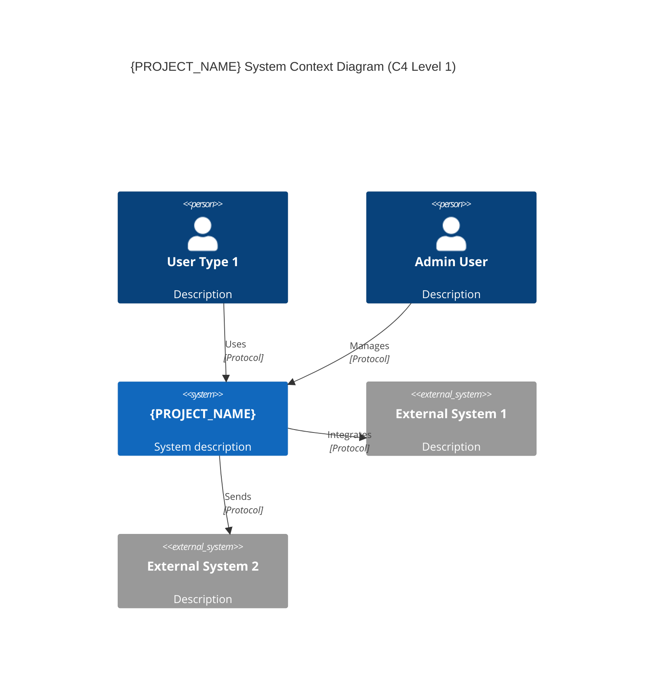
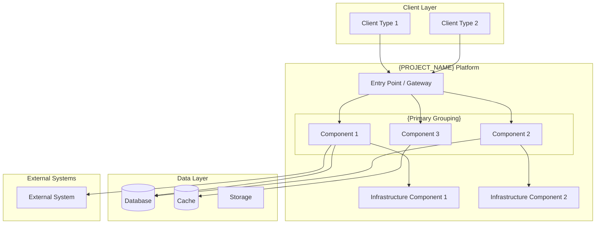
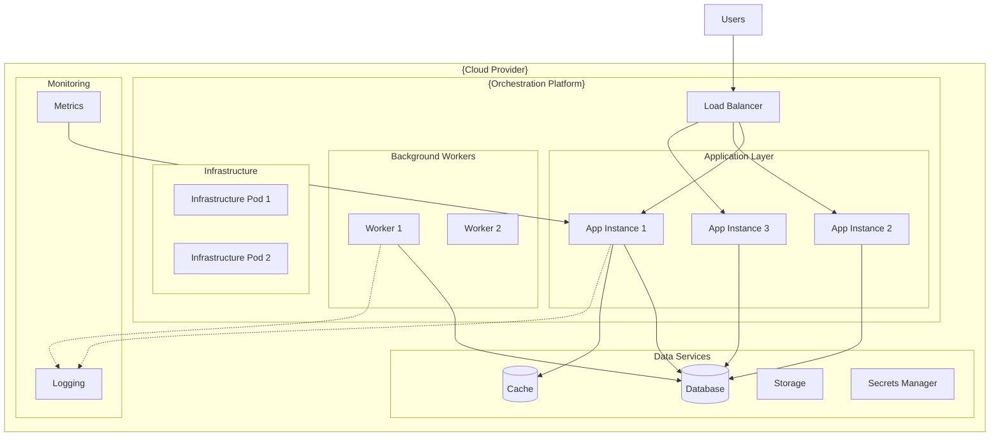
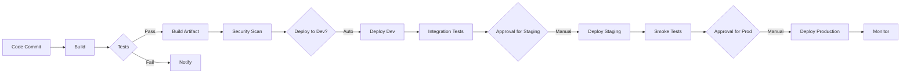
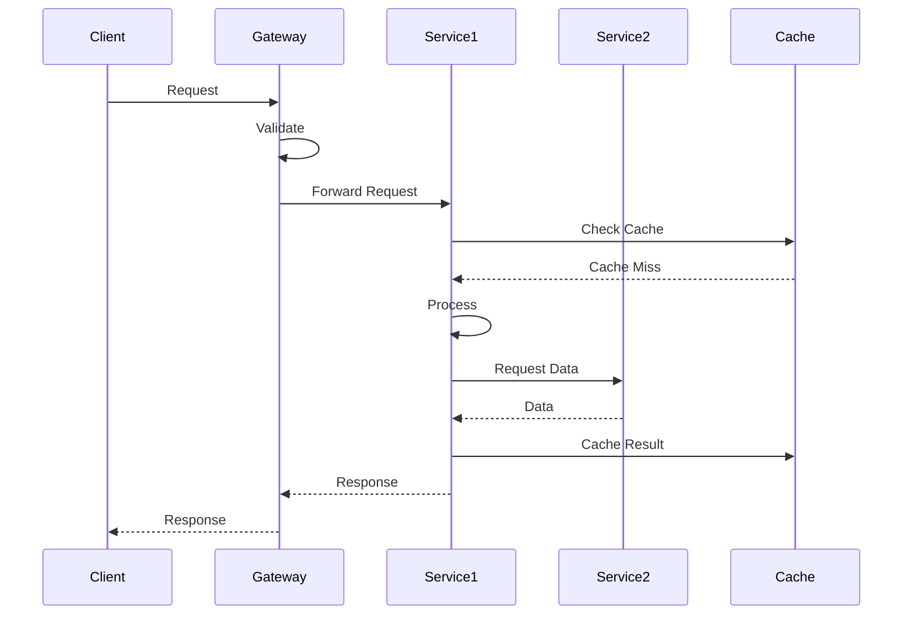
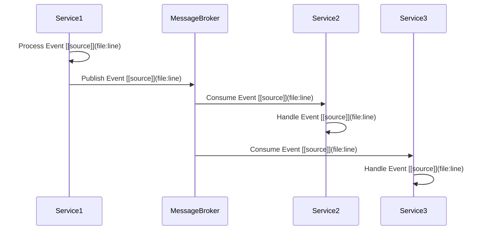
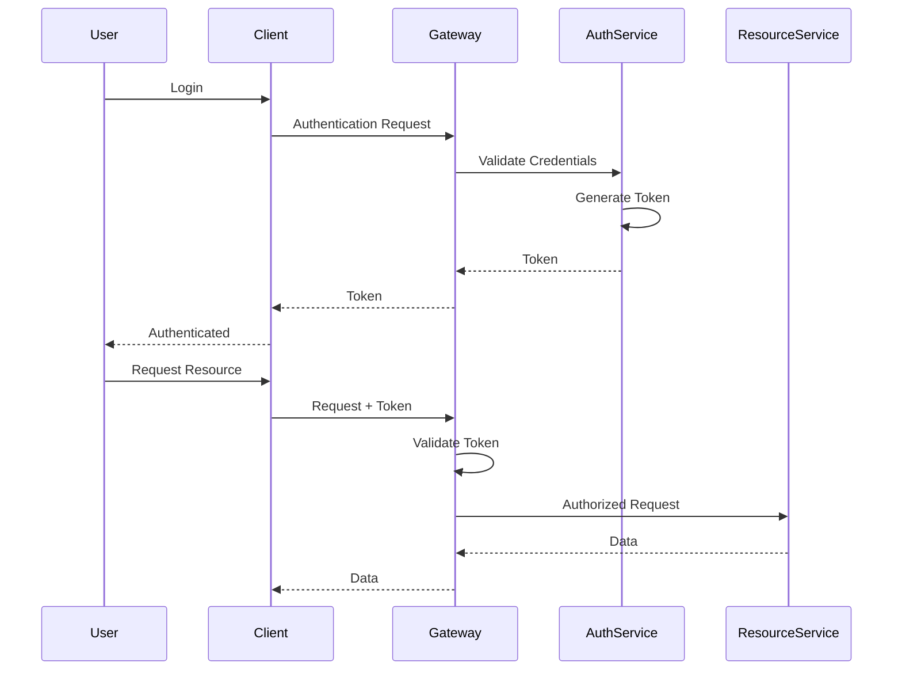

# System Architecture: {PROJECT_NAME}

<!--
⚠️ CRITICAL CITATION REQUIREMENTS ⚠️

EVERY technical claim in this document MUST have an inline citation to source code.
This is THE most technical document - citations are absolutely mandatory.

WORKFLOW FOR WRITING THIS DOCUMENT:
1. For each section, FIRST search for source code evidence using Task/Explore agents
2. Gather all file paths and line numbers BEFORE writing prose
3. Write WITH citations inline - never write a sentence without its citation
4. Use format: "claim text [📄](path/to/file.ext:line)"
5. Validate every claim has a citation before moving to the next section

WHAT NEEDS CITATIONS (EVERYTHING TECHNICAL):
✅ Every service/component name (cite service class, main file, or entry point)
✅ Every technology mentioned (cite package.json, imports, config files)
✅ Every endpoint/API (cite controller method, route definition)
✅ Every database/cache (cite connection config, client initialization)
✅ Every deployment config (cite Dockerfile, k8s manifests, CI/CD files)
✅ Every security mechanism (cite middleware, auth handlers, config)
✅ Every communication pattern (cite message producers/consumers, HTTP clients)
✅ Every monitoring/logging setup (cite logger config, instrumentation code)

GOOD EXAMPLE:
"The User Service [📄](src/services/user/UserService.ts:15) handles authentication [📄](src/services/user/auth/AuthController.ts:23) and uses PostgreSQL [📄](src/services/user/db/connection.ts:8) for persistence."

BAD EXAMPLE:
"The User Service handles authentication and uses PostgreSQL for persistence."
↑ No citations - completely unacceptable for technical documentation

TEMPLATE INSTRUCTIONS:
- Replace {PROJECT_NAME} with actual project name
- Search for evidence BEFORE writing each section
- Include inline citations [📄](path/file:line) for EVERY technical claim
- Create C4 diagrams based on actual architecture
- Document all services/modules with citations to their definitions
- List actual technologies with citations to package files or configs
- NEVER write placeholder text without finding and citing actual source code
- Do not confabulate - every claim must be verifiable from source code
-->

## Who Should Read This

This document is intended for:
- **Software Engineers**: Understand the system's technical architecture
- **Solution Architects**: Learn architectural patterns and design decisions
- **DevOps Engineers**: Understand deployment and infrastructure
- **Technical Leaders**: Evaluate technology choices and scalability

**Prerequisites**: Basic understanding of {relevant architectural concepts}

**Reading Time**: 45-60 minutes

---

## Table of Contents

1. [Architecture Overview](#architecture-overview)
2. [{Primary Decomposition} Deep Dive](#primary-decomposition-deep-dive)
3. [Technology Stack](#technology-stack)
4. [Deployment Architecture](#deployment-architecture)
5. [Communication Patterns](#communication-patterns)
6. [Security Architecture](#security-architecture)
7. [Data Architecture](#data-architecture)
8. [Monitoring & Observability](#monitoring--observability)

---

## Architecture Overview

### High-Level Architecture

{PROJECT_NAME} follows a **{architectural pattern}** with {key characteristics}.



### Container Architecture (C4 Level 2)



### Key Architectural Characteristics

| Characteristic | Approach | Rationale |
|----------------|----------|-----------|
| **Style** | {Architectural style} | {Reason for choice} |
| **Communication** | {Sync/Async patterns} | {Reason for choice} |
| **Data Management** | {Data strategy} | {Reason for choice} |
| **Deployment** | {Deployment approach} | {Reason for choice} |
| **{Key Aspect}** | {Approach} | {Rationale} |
| **Observability** | {Monitoring approach} | {Rationale} |
| **Security** | {Security approach} | {Rationale} |

---

## {Primary Decomposition} Deep Dive

### {Component/Service} Catalog

{PROJECT_NAME} consists of **{N} core {components/services/modules}**.

<!-- WORKFLOW: Search for this component's main file, controller, and config BEFORE writing -->

### 1. {Component Name} [📄](path/to/main-service-file:line)

**Namespace/Package**: `{namespace.path}` [📄](path/to/package-or-namespace-definition:line)
**Repository**: `{repo-name}` [📄](path/to/repo-config:line)
**{Identifier}**: {Value} [📄](path/to/identifier-definition:line)

#### Responsibilities
- **{Primary responsibility 1}** [📄](path/to/service-class:line)
  - {Sub-responsibility with code reference} [📄](path/to/implementation:line)
  - {Sub-responsibility with code reference} [📄](path/to/implementation:line)
- **{Primary responsibility 2}** [📄](path/to/service-class:line)
  - {Sub-responsibility} [📄](path/to/implementation:line)

#### Key Endpoints/Interfaces
<!-- WORKFLOW: Search for route definitions or controller methods BEFORE listing -->
```
{METHOD}  /{path}/{endpoint}  [📄](path/to/controller:line)
{METHOD}  /{path}/{endpoint}  [📄](path/to/controller:line)
{METHOD}  /{path}/{endpoint}  [📄](path/to/controller:line)
```

#### Domain Entities/Models
<!-- WORKFLOW: Search for model class definitions BEFORE listing -->
- `{Entity1}` [📄](path/to/model:line): {Description}
- `{Entity2}` [📄](path/to/model:line): {Description}
- `{Entity3}` [📄](path/to/model:line): {Description}

#### Dependencies
<!-- WORKFLOW: Search for config files, connection code BEFORE listing -->
- **Databases**: {Databases used} [📄](path/to/db-config:line)
- **External Services**: {External dependencies} [📄](path/to/client-or-config:line)
- **Cache**: {Caching layer} [📄](path/to/cache-config:line)
- **Message Queue**: {Messaging} [📄](path/to/queue-config:line)

#### Technology Details
<!-- WORKFLOW: Search for package.json, imports, framework usage BEFORE listing -->
- **Framework**: {Framework and version} [📄](package.json:line OR project-file:line)
- **{Technology}**: {Usage and version} [📄](path/to/usage-or-import:line)
- **{Technology}**: {Usage and version} [📄](path/to/usage-or-import:line)

<!-- Repeat the above structure for each component/service with citations -->

---

## Technology Stack

<!-- WORKFLOW: Search for package.json, go.mod, requirements.txt, etc. BEFORE writing -->
<!-- WORKFLOW: For each technology, find WHERE it's imported/configured BEFORE adding to table -->

### Backend Technologies

| Technology | Version | Usage |
|------------|---------|-------|
| **{Language}** | {version} | {usage} [📄](package.json:line OR equivalent) |
| **{Framework}** | {version} | {usage} [📄](path/to/main-file-or-import:line) |
| **{Library}** | {version} | {usage} [📄](package.json:line) [📄](path/to/usage:line) |
<!-- Add all backend technologies with citations -->

### Data Layer

| Technology | Purpose | Usage |
|------------|---------|-------|
| **{Database}** | {database type} | {usage} [📄](path/to/connection-config:line) |
| **{Cache}** | {cache type} | {usage} [📄](path/to/cache-client:line) |
| **{Storage}** | {storage type} | {usage} [📄](path/to/storage-config:line) |
| **{Technology}** | {purpose} | {usage} [📄](path/to/config:line) |

### Infrastructure

| Technology | Purpose | Usage |
|------------|---------|-------|
| **{Container Tech}** | Containerization | {usage} [📄](Dockerfile:line) |
| **{Orchestration}** | Container orchestration | {usage} [📄](path/to/k8s-manifest:line) |
| **{Deployment}** | Deployment automation | {usage} [📄](path/to/deploy-script:line) |
| **{CI/CD}** | Continuous integration/deployment | {usage} [📄](.github/workflows/ci.yml:line) |
| **{Monitoring}** | Observability | {usage} [📄](path/to/monitoring-config:line) |

### Frontend (if applicable)

| Technology | Purpose | Status |
|------------|---------|--------|
| **{Framework}** | {purpose} | {status} [📄](frontend/package.json:line) |
| **{Library}** | {purpose} | {status} [📄](frontend/package.json:line) |

### External Integrations

| Technology | Purpose |
|------------|---------|
| **{Protocol/Service}** | {purpose} [📄](path/to/client-or-integration:line) |
| **{Protocol/Service}** | {purpose} [📄](path/to/client-or-integration:line) |

---

## Deployment Architecture

### {Orchestration Platform} Architecture



### Deployment Characteristics (To the degree identifiable)

| Aspect | Configuration | Notes |
|--------|---------------|-------|
| **Platform** | {Platform name} | {Details} [[source]](file:line) |
| **Compute** | {Instance/node type} | {Scaling details} [[source]](file:line) |
| **Networking** | {Network config} | {Details} [[source]](file:line) |
| **Namespace/Environment** | {Naming convention} | {Purpose} [[source]](file:line) |
| **Replica Count** | {Min}-{Max} ({scaling method}) | {Details} [[source]](file:line) |
| **Auto-scaling** | {Scaling approach} | {Triggers} [[source]](file:line) |
| **Resource Limits** | {CPU/Memory limits} | {Per instance} [[source]](file:line) |
| **Health Checks** | {Health check config} | {Frequency} [[source]](file:line) |
| **Rolling Updates** | {Update strategy} | {Zero-downtime approach} [[source]](file:line) |

### {Deployment Tool} Structure

```
deployment/
├── {env1}/
│   ├── config.yaml
│   ├── values.yaml
│   └── templates/
│       ├── deployment.yaml
│       ├── service.yaml
│       ├── ingress.yaml
│       └── configmap.yaml
├── {env2}/
└── {env3}/
```

### Environment Strategy

| Environment | Purpose | Data | Infrastructure |
|-------------|---------|------|----------------|
| **Development** | Local development | {Data strategy} | {Infrastructure} |
| **Staging** | Integration testing | {Data strategy} | {Infrastructure} |
| **Production** | Live system | {Data strategy} | {Infrastructure} |

### CI/CD Pipeline



---

## Communication Patterns

### Synchronous Communication

{PROJECT_NAME} uses **{protocol}** for synchronous communication.



**Communication Characteristics**:
- **Protocol**: {Protocol details}
- **Format**: {Data format}
- **Idempotency**: {Idempotency approach}
- **Versioning**: {Versioning strategy}
- **Error Handling**: {Error handling approach}

### Asynchronous Communication

For **{use cases}**, {PROJECT_NAME} uses **{messaging technology}**.



**Event Types**:
<!-- WORKFLOW: Search for event publishers, message producers, event definitions BEFORE listing -->
- **{EventType1}**: {Description and payload} [📄](path/to/event-producer:line) [📄](path/to/event-definition:line)
- **{EventType2}**: {Description and payload} [📄](path/to/event-producer:line) [📄](path/to/event-definition:line)
- **{EventType3}**: {Description and payload} [📄](path/to/event-producer:line) [📄](path/to/event-definition:line)

### Service-to-Service Communication

{Description of how services communicate with each other}

**Patterns Used**:
- **{Pattern 1}**: {Usage and rationale} [[source]](file:line)
- **{Pattern 2}**: {Usage and rationale} [[source]](file:line)
- **{Pattern 3}**: {Usage and rationale} [[source]](file:line)

---

## Security Architecture

### Defense in Depth

```mermaid
graph TB
    A[Network Security] --> B[Application Security]
    B --> C[API Security]
    C --> D[Data Security]

    A1[{Security Control 1}] --> A
    A2[{Security Control 2}] --> A

    B1[{Security Control 1}] --> B
    B2[{Security Control 2}] --> B

    C1[{Security Control 1}] --> C
    C2[{Security Control 2}] --> C

    D1[{Security Control 1}] --> D
    D2[{Security Control 2}] --> D
```

### Authentication Flow



### Authorization Model

**{Authorization Approach}**:
- **{Role/Permission 1}**: {Description and access} [[source]](file:line)
- **{Role/Permission 2}**: {Description and access} [[source]](file:line)
- **{Role/Permission 3}**: {Description and access} [[source]](file:line)

### Secrets Management

- **{Secrets Technology}**: {Usage and scope} [[source]](file:line)
- **Encryption**: {Encryption approach} [[source]](file:line)
- **Rotation**: {Rotation policy} [[source]](file:line)

### Security Best Practices

1. **{Practice 1}**: {Description and implementation} [[source]](file:line)
2. **{Practice 2}**: {Description and implementation} [[source]](file:line)
3. **{Practice 3}**: {Description and implementation} [[source]](file:line)

---

## Data Architecture

### Database Strategy

**{Data Strategy Name}**: {Description}

| Database | Type | Usage |
|----------|------|-------|
| **{Database 1}** | {Type} | {Usage} |
| **{Database 2}** | {Type} | {Usage} |

### Database Organization

```mermaid
graph LR
    subgraph "{Database Technology}"
        DB1[(Database 1<br/>{Purpose})]
        DB2[(Database 2<br/>{Purpose})]
        DB3[(Database 3<br/>{Purpose})]
    end

    SERVICE1[Service 1] --> DB1
    SERVICE2[Service 2] --> DB1
    SERVICE3[Service 3] --> DB2
    SERVICE4[Service 4] --> DB3
```

### Data Access Patterns

1. **{Pattern 1}**: {Description and implementation} [[source]](file:line)
2. **{Pattern 2}**: {Description and implementation} [[source]](file:line)
3. **{Pattern 3}**: {Description and implementation} [[source]](file:line)

### Data Consistency

- **{Consistency Model}**: {Description and scope} [[source]](file:line)
- **{Transaction Pattern}**: {Usage and implementation} [[source]](file:line)

---

## Monitoring & Observability

### Logging Strategy

**{Logging Approach}**:
- **Format**: {Log format}
- **Levels**: {Log levels used}
- **Aggregation**: {Log aggregation approach}

### Metrics & Dashboards

**Key Metrics**:
- **{Metric Category 1}**: {Metrics tracked} [[source]](file:line)
- **{Metric Category 2}**: {Metrics tracked} [[source]](file:line)
- **{Metric Category 3}**: {Metrics tracked} [[source]](file:line)

**Dashboards**:
1. **{Dashboard 1}**: {Purpose and metrics} [[source]](file:line)
2. **{Dashboard 2}**: {Purpose and metrics} [[source]](file:line)
3. **{Dashboard 3}**: {Purpose and metrics} [[source]](file:line)

### Health Checks

Each component exposes health check endpoints:
- **{Endpoint}**: {Purpose and checks} [[source]](file:line)
- **{Endpoint}**: {Purpose and checks} [[source]](file:line)

### Alerting

**Alert Categories**:
1. **Critical**: {Description and response time}
2. **High**: {Description and response time}
3. **Medium**: {Description and response time}
4. **Low**: {Description and response time}

---

## Additional Source Code References

<!-- Add actual source code references with file paths and line numbers -->
**[1]** {Description}: [{file-path}]({file-path}) (Lines {start}-{end})

---

## Related Documents

- [Data Model & Relationships](02-DATA-MODEL-AND-RELATIONSHIPS.md)
- [Business Rules & Requirements](03-BUSINESS-RULES-AND-REQUIREMENTS.md)
- [Integration & API Guide](04-INTEGRATION-AND-API-GUIDE.md)
- [Quick Reference](05-QUICK-REFERENCE.md)

---

*Generated By LegacyLift AI by CapTech*
*Generated on: {GENERATED_DATE}*
