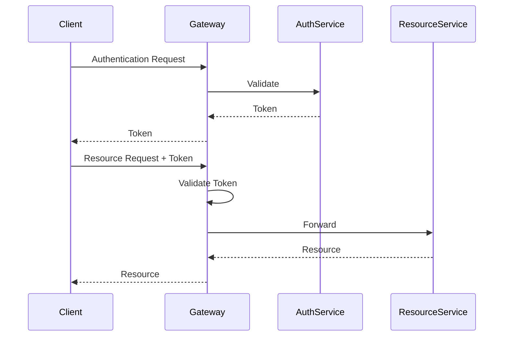
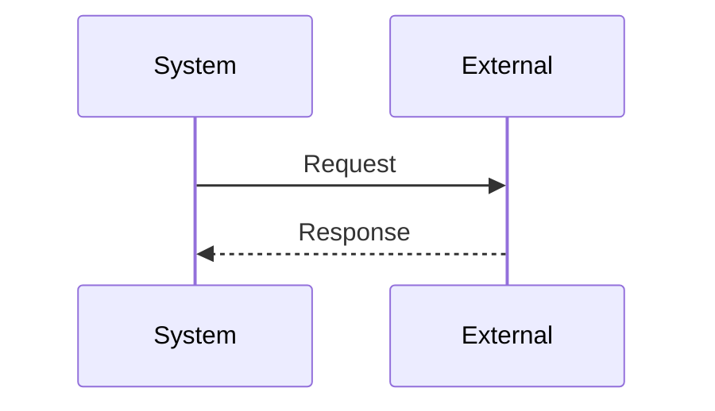
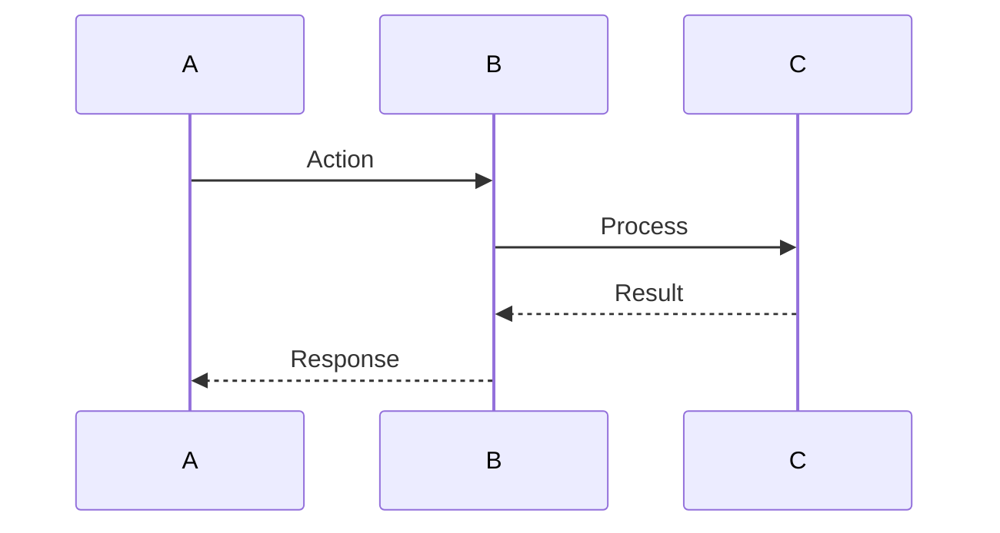

# Integration & API Guide: {PROJECT_NAME}

<!--
⚠️ CRITICAL CITATION REQUIREMENTS ⚠️

EVERY API endpoint, integration, and authentication mechanism MUST have an inline citation.
APIs are code - cite every endpoint, parameter, response, and integration.

WORKFLOW FOR WRITING THIS DOCUMENT:
1. Search for controllers, routes, API definitions, clients BEFORE writing
2. Gather all file paths and line numbers BEFORE writing prose
3. Write WITH citations inline - never document an endpoint without citing its definition
4. Use format: "GET /api/users [📄](path/to/controller:line)"
5. Validate every claim has a citation before moving to next section

WHAT NEEDS CITATIONS:
✅ Every API endpoint (cite route definition, controller method, or API spec)
✅ Every request parameter (cite parameter definition, validation, or schema)
✅ Every response format (cite response model, serializer, or return type)
✅ Every authentication method (cite auth middleware, handler, or strategy)
✅ Every integration point (cite client class, API call, or adapter)
✅ Every rate limit (cite rate limiter config or middleware)
✅ Every error code (cite error handler, error enum, or response definition)
✅ Every webhook (cite webhook handler, subscription logic, or callback)

GOOD EXAMPLE:
"GET /api/users [📄](src/controllers/UserController.ts:45) returns user list [📄](src/models/UserResponse.ts:12). Requires Bearer token authentication [📄](src/middleware/auth.ts:23). Rate limited to 100 req/min [📄](src/middleware/rateLimiter.ts:67)."

BAD EXAMPLE:
"GET /api/users returns user list. Requires Bearer token authentication. Rate limited to 100 req/min."
↑ No citations - completely unacceptable for API documentation

TEMPLATE INSTRUCTIONS:
- Replace {PROJECT_NAME} with actual project name
- Search for route definitions BEFORE documenting each endpoint
- Cite every endpoint, auth mechanism, integration with [📄](path/file:line)
- Create sequence diagrams based on actual code flow
- NEVER document an API without citing its implementation
- Do not confabulate - every claim must be verifiable from source code
-->

## Who Should Read This

This document is intended for:
- **Integration Engineers**: Build integrations with {PROJECT_NAME}
- **External Partners**: Understand how to connect systems
- **Software Engineers**: Implement API clients and integrations
- **Solution Architects**: Design integration architecture
- **DevOps Engineers**: Configure and deploy integrations

**Prerequisites**: Understanding of REST APIs, {authentication methods}, and {integration patterns}

**Reading Time**: 40-50 minutes

---

## Table of Contents

1. [Integration Overview](#integration-overview)
2. [API Architecture](#api-architecture)
3. [Authentication & Authorization](#authentication--authorization)
4. [API Endpoints Reference](#api-endpoints-reference)
5. [Event-Driven Architecture](#event-driven-architecture)
6. [External System Integrations](#external-system-integrations)
7. [Integration Patterns](#integration-patterns)
8. [Error Handling & Retry Logic](#error-handling--retry-logic)
9. [Rate Limiting & Throttling](#rate-limiting--throttling)
10. [Best Practices](#best-practices)

---

## Integration Overview

### Integration Types

{PROJECT_NAME} supports {N} primary integration patterns:

```mermaid
graph TB
    SYSTEM[{PROJECT_NAME} Platform]

    subgraph "Inbound Integrations"
        IN1[{Integration Type 1}]
        IN2[{Integration Type 2}]
        IN3[{Integration Type 3}]
    end

    subgraph "Outbound Integrations"
        OUT1[{Integration Type 1}]
        OUT2[{Integration Type 2}]
        OUT3[{Integration Type 3}]
    end

    IN1 --> SYSTEM
    IN2 --> SYSTEM
    IN3 --> SYSTEM

    SYSTEM --> OUT1
    SYSTEM --> OUT2
    SYSTEM --> OUT3
```

### Integration Capabilities

| Integration Type | Method | Use Case | Frequency |
|------------------|--------|----------|-----------|
| **{Type}** [[source]](file:line) | {Method} | {Use case} | {Frequency} |
| **{Type}** [[source]](file:line) | {Method} | {Use case} | {Frequency} |
| **{Type}** [[source]](file:line) | {Method} | {Use case} | {Frequency} |

---

## API Architecture

### API Gateway / Entry Point

All API requests go through the **{Gateway/Entry Point}**, which provides:
- {Feature 1}
- {Feature 2}
- {Feature 3}
- {Feature 4}

```mermaid
graph LR
    CLIENT[API Client] --> GATEWAY[{Gateway/Entry Point}]

    GATEWAY --> SERVICE1[Service 1<br/>{path prefix}]
    GATEWAY --> SERVICE2[Service 2<br/>{path prefix}]
    GATEWAY --> SERVICE3[Service 3<br/>{path prefix}]
```

### Base URL

```
Production [[source]](file:line):  https://{production-url}
Staging [[source]](file:line):     https://{staging-url}
Development [[source]](file:line): https://{dev-url}
```

### API Versioning

{PROJECT_NAME} uses **{versioning strategy}**:

```http
{Example request showing versioning}
```

**Supported Versions**:
- `{version}` - {Status and description}
- `{version}` - {Status and description}

**Deprecation Policy**:
- {Deprecation policy details}

### API Conventions

**HTTP Methods**:
- `GET` - {Usage} [[source]](file:line)
- `POST` - {Usage} [[source]](file:line)
- `PUT` - {Usage} [[source]](file:line)
- `PATCH` - {Usage} [[source]](file:line)
- `DELETE` - {Usage} [[source]](file:line)

**Response Format** [[source]](file:line):
- {Format description}
- {Date/time formats}
- {Encoding}

**Naming Conventions**:
- {Conventions}

---

## Authentication & Authorization

### Authentication Flow

{PROJECT_NAME} uses **{authentication method}** for API authentication.



### Obtaining an Access Token

**Request**:
```http
{Example authentication request}
```

**Response**:
```http
{Example authentication response}
```

### Using the Access Token

Include the access token in requests:

```http
{Example authenticated request}
```

### Token Refresh (if applicable)

**Request**:
```http
{Example refresh request}
```

**Response**:
```http
{Example refresh response}
```

### Authorization Scopes

{Description of authorization model}

**{Role/Permission Model}**:
- **{Role/Permission}**: {Description} [[source]](file:line)
- **{Role/Permission}**: {Description} [[source]](file:line)
- **{Role/Permission}**: {Description} [[source]](file:line)

---

## API Endpoints Reference

### {Domain/Service} API (`{path prefix}`)

#### {Operation Name}  [[source]](file:line)
```http
{METHOD} {path}
```

**Description**: {Description of operation}

**Request Parameters**:
- `{param}` ({type}, {required/optional}): {description}
- `{param}` ({type}, {required/optional}): {description}

**Request Body** (if applicable):
```json
{
  "example": "request body"
}
```

**Response**:
```http
HTTP/1.1 {status} {status text}
Content-Type: application/json

{
  "example": "response body"
}
```

<!-- Repeat for other key endpoints -->

---

## Event-Driven Architecture

### Event Streaming [[source]](file:line)

{PROJECT_NAME} publishes events to **{messaging system}** for real-time integration.

```mermaid
graph LR
    COMP1[Component 1] --> BROKER[{Messaging System}]
    COMP2[Component 2] --> BROKER
    COMP3[Component 3] --> BROKER

    BROKER --> QUEUE1[Queue 1]
    BROKER --> QUEUE2[Queue 2]

    QUEUE1 --> CONSUMER1[Consumer 1]
    QUEUE2 --> CONSUMER2[Consumer 2<br/>Your System]
```

### Event Types

| Event Type | Description | Payload Fields |
|------------|-------------|----------------|
| `{EventType}` [[source]](file:line) | {Description} | {Key fields} |
| `{EventType}` [[source]](file:line) | {Description} | {Key fields} |
| `{EventType}` [[source]](file:line) | {Description} | {Key fields} |

### Event Schema

```json
{
  "eventId": "unique-id",
  "eventType": "EventType",
  "timestamp": "2025-11-05T10:00:00Z",
  "data": {
    "example": "payload"
  }
}
```

### Webhook Integration (if applicable)

**Configure Webhook**:
```http
{Example webhook configuration request}
```

**Webhook Delivery**:
```http
{Example webhook delivery}
```

**Verify Signature**:
```{language}
{Example signature verification code}
```

---

## External System Integrations

### {External System} Integration

**Configuration**:
```json
{
  "example": "configuration"
}
```

**Integration Flow**:


<!-- Repeat for other external integrations -->

---

## Integration Patterns

### Pattern {N}: {Pattern Name}



**Use Case**: {Description}

**Implementation**:
```{language}
{Example implementation code}
```

<!-- Repeat for other integration patterns -->

---

## Error Handling & Retry Logic

### Error Response Format

```json
{
  "Error": {
    "Code": "ERROR_CODE",
    "Message": "Human-readable message",
    "Details": "Additional details",
    "RequestId": "request-id",
    "Timestamp": "2025-11-05T10:00:00Z"
  }
}
```

### HTTP Status Codes

| Status Code | Meaning | Action |
|-------------|---------|--------|
| `200` [[source]](file:line) | OK | Process response |
| `201` [[source]](file:line) | Created | Use returned ID |
| `400` [[source]](file:line) | Bad Request | Fix request |
| `401` [[source]](file:line) | Unauthorized | Re-authenticate |
| `403` [[source]](file:line) | Forbidden | Check permissions |
| `404` [[source]](file:line) | Not Found | Check resource ID |
| `429` [[source]](file:line) | Too Many Requests | Implement backoff |
| `500` [[source]](file:line) | Internal Server Error | Retry |
| `503` [[source]](file:line) | Service Unavailable | Retry |

### Retry Strategy

**Exponential Backoff**:
```{language}
{Example retry implementation}
```

---

## Rate Limiting & Throttling

### Rate Limits

| Scope | Limit | Window |
|-------|-------|--------|
| **{Scope}** | {N} requests | {Time period} |
| **{Scope}** | {N} requests | {Time period} |

### Rate Limit Headers

```http
HTTP/1.1 200 OK
X-RateLimit-Limit: {limit}
X-RateLimit-Remaining: {remaining}
X-RateLimit-Reset: {timestamp}
```

### Exceeding Rate Limit

```http
HTTP/1.1 429 Too Many Requests
Retry-After: {seconds}

{
  "Error": {
    "Code": "RATE_LIMIT_EXCEEDED",
    "Message": "Rate limit exceeded. Retry after {seconds} seconds"
  }
}
```

---

## Additional Source Code References

<!-- Add actual source code references -->
**[1]** {Description}: [{file-path}]({file-path}) (Lines {start}-{end})

---

## Related Documents

- [System Architecture](01-SYSTEM-ARCHITECTURE.md)
- [Data Model & Relationships](02-DATA-MODEL-AND-RELATIONSHIPS.md)
- [Business Rules & Requirements](03-BUSINESS-RULES-AND-REQUIREMENTS.md)
- [Quick Reference](05-QUICK-REFERENCE.md)

---

*Generated By LegacyLift AI by CapTech*
*Generated on: {GENERATED_DATE}*
