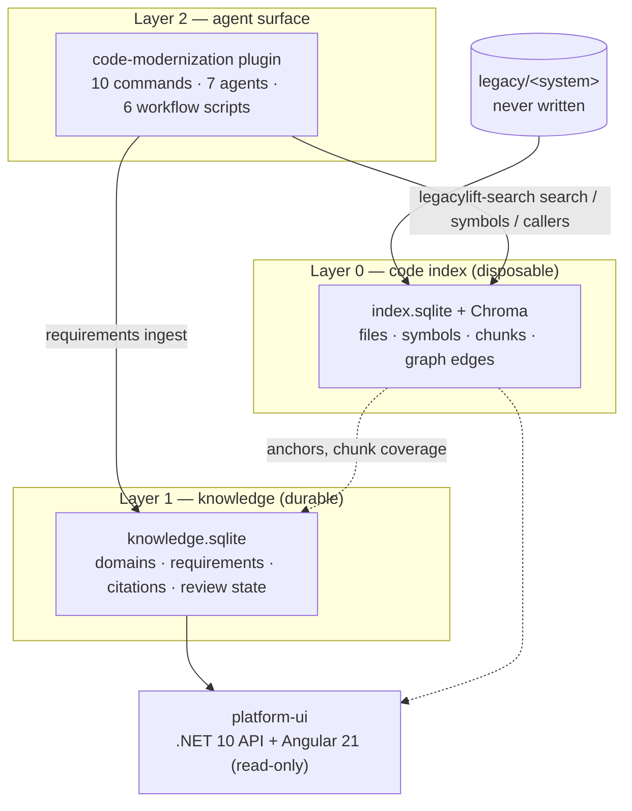

# LegacyLift v4 Architecture

> **Reference guide for working on LegacyLift v4** — the three components it is made of, the
> contracts between them, and the decisions that are load-bearing.

**Scope.** This document covers **v4 only**. LegacyLift v3.7 ("legacylift-classic") is a separate
approach that shares no component with v4; its architecture is documented in its own plugin at
[`.claude/skills/legacylift-classic/README.md`](../.claude/skills/legacylift-classic/README.md).
Nothing here applies to it, and v4 never invokes its skills.

---

## Table of Contents

1. [The shape of v4](#1-the-shape-of-v4)
2. [The workspace on disk](#2-the-workspace-on-disk)
3. [Component 1 — the `code-modernization` plugin](#3-component-1--the-code-modernization-plugin)
4. [Component 2 — `legacylift-search`](#4-component-2--legacylift-search)
5. [Layer 0 — the code index](#5-layer-0--the-code-index)
6. [Layer 1 — the knowledge store](#6-layer-1--the-knowledge-store)
7. [Requirements as data](#7-requirements-as-data)
8. [Component 3 — `platform-ui`](#8-component-3--platform-ui)
9. [Cross-cutting concerns](#9-cross-cutting-concerns)
10. [Repository map](#10-repository-map)
11. [In-flight work](#11-in-flight-work)

---

## 1. The shape of v4

v4 is **three deployable components** over **three layers**. The components are the things you
install and run; the layers are how responsibility is divided.



**The load-bearing decision is the Layer 0 / Layer 1 boundary.** Layer 0 is machine-derived and
rebuildable at any time from source; Layer 1 holds human judgment — domain assignments, approved
requirements, reviewer notes — and must never be casually destroyed. A full `index --reset` rebuilds
Layer 0 and stops at that boundary.

> **The boundary is logical, not physical.** Both stores live under the same `analysis/<system>/`
> directory (§2). `index --reset` does not touch `knowledge.sqlite`, but **deleting or clearing
> `analysis/` destroys both**, including domain tagging. Re-run `tag-domains` before `map` if you
> have cleared the tree.

Each component also degrades independently. The plugin's discovery commands check for a usable
index and fall back to `grep` when there is none; `/modernize-extract-rules` renders
`BUSINESS_RULES.md` from the store when the CLI is present and from the workflow's return value when
it is not. The index is an accelerant, never a requirement.

---

## 2. The workspace on disk

v4 analyzes a **workspace** — a directory holding the system under analysis beside the output
written about it. The invariant is that `legacy/` is read-only and everything generated lands in
`analysis/`.

```
<workspace>/
  legacy/
    <system>/                          the client checkout — NEVER written
  analysis/
    <system>/
      PREFLIGHT.md                     /modernize-preflight
      ASSESSMENT.md                    /modernize-assess
      ARCHITECTURE.mmd
      TOPOLOGY.html  topology.json     /modernize-map
      call-graph.mmd  data-lineage.mmd  critical-path.mmd
      domains.json                     capability domains (authored by assess)
      SECRETS.local.md                 gitignored credential quarantine
      index/code-search/
        index.sqlite                   Layer 0 — metadata, symbols, graph, FTS5
        chroma/                        Layer 0 — code chunk vectors
        manifest.snapshot.json
      knowledge/
        knowledge.sqlite               Layer 1 — domains + requirements
        chroma/                        Layer 1 — requirement-statement vectors
        extracted-rules.json           raw extractor output, kept verbatim
        requirements.jsonl             git-committable export
  modernized/
    <system>-reimagined/               /modernize-reimagine output
```

**Path resolution.** `legacylift-search` finds the analysis directory in this order
(`config.py:resolve_analysis_dir`):

1. `--analysis-dir` — an explicit override that governs **both** stores.
2. `--index-dir` — names the index directory only; narrower, and wins for the index alone.
3. Convention — if `<repo_root>.parent` is named **`legacy`** *and*
   `<repo_root>/../../analysis/<repo_root.name>` already **exists**, that is the analysis
   directory. Both conditions are deliberate: the convention only fires inside a real
   `legacy/` + `analysis/` layout.
4. Fallback — otherwise there is **no** analysis directory, and the two stores resolve to
   `<repo_root>/legacylift-docs/index/code-search` and `<repo_root>/legacylift-docs/knowledge`
   (`config.py:resolve_index_dir` branch 4). **This is the branch that fires for
   `repos/<system>/<unit>`**, the layout the plugin's own README prescribes and the one the
   tracked CTCM corpora sit in — so on such a tree both Layer 0 and Layer 1 live under
   `legacylift-docs/` inside the checkout, not under `analysis/`. No `/modernize-*` command passes
   `--analysis-dir`, so nothing overrides it. The client's own **source** is still never written;
   what lands in the checkout is generated output, and the whole `legacylift-docs/index/` tree is
   gitignored.

Index and knowledge then resolve to `<analysis_dir>/index/code-search` and
`<analysis_dir>/knowledge`.

**Repo settings.** `semantic-search.manifest.json` at the workspace root configures the walk
(`include_globs`, `exclude_globs`, `max_file_bytes`), the index location, chunking targets, the
embedding provider, and search defaults. It is the one file to edit when coverage is wrong.

**It is optional, and absent means current.** With no manifest the CLI falls back to
`config.py`'s `Manifest()` defaults (`cli.py:120-125`), which are the maintained ones — the
2026-09-08 coverage widening landed there, not in any checked-in file. A manifest that restates a
default freezes it: this repository carried one at its root until 2026-09-14, and by then it was
shadowing the live allow-list with its pre-widening 20 `include_globs` and 23 `exclude_globs`. Write one only for the fields an
engagement genuinely changes, and generate it with `legacylift-search init-config` rather than by
hand.

---

## 3. Component 1 — the `code-modernization` plugin

Location: [`.claude/skills/code-modernization/`](../.claude/skills/code-modernization/). A Claude
Code plugin — `.claude-plugin/plugin.json`, `README.md`, `LICENSE`, plus `commands/`, `agents/`,
`workflows/` and `assets/`.

**Installing it.** Copy the directory into the workspace you will run the commands in, at
`./.claude/skills/code-modernization/` — that exact path:

```bash
mkdir -p .claude/skills
cp -r /path/to/legacylift-ai/.claude/skills/code-modernization .claude/skills/
```

There is no marketplace install. `/plugin install code-modernization@claude-plugins-official`
fetches **Anthropic's stock plugin**, which is not this one: the fork carries the Layer-0 retrieval
contract, the requirements-store ingest and the domain steps. Worse, a marketplace copy takes
precedence over `.claude/skills/`, so with both present the `/modernize-*` commands run stock
behaviour and nothing says so. Uninstall the upstream plugin before relying on this one.

**Licensing — two files, and the distinction is load-bearing.** This plugin is Anthropic's, Apache
2.0, and it is the repository's only third-party component. The directory carries **both** licences,
because the install instructions tell people to copy it into a client workspace and each licence has
to travel:

- **`LICENSE`** is the **pristine upstream Apache text** and is never edited. It is the copy §4(a)
  obliges you to hand to anyone who receives the plugin; editing it destroys the one job it has.
- **`LICENSE.md`** is CapTech's proprietary licence, a byte-identical copy of the repository root's,
  covering **CapTech's modifications only**. Apache 2.0 §4 expressly permits licensing one's own
  modifications under different terms, and §9 of that file reconciles the two. Its proprietary claim
  is written with an explicit Section 9 exception, so it does not read as a claim over the Anthropic
  code it sits beside — and it cannot restrict a recipient's Apache rights in the Anthropic-authored
  portions, including those inside files CapTech has modified.

Attribution text lives in `NOTICE` at the repository root, mirrored as `LICENSE.md`'s Exhibit B —
`NOTICE` is canonical; correct the Exhibit if they drift. Upstream ships no NOTICE file of its own.
Which upstream commit this fork was taken at is recorded in `.claude-plugin/.upstream`, alongside how
to verify it and what has changed upstream since; re-vendoring means updating that file, `LICENSE.md`
§9 and `NOTICE` together.

**These duplicates are CI-enforced.** `tools/legacylift_search/tests/test_license_files_are_in_sync.py`
fails the build if the plugin's `LICENSE.md` drifts from the root's, if `NOTICE` drifts from Exhibit
B, if the Apache `LICENSE` is edited or truncated, or if §9's carve-out is renumbered away. Legal
text copied into two places and checked by nobody is text that diverges silently, and the copy that
goes wrong is the one in a client's workspace. **Whenever you modify any file under
`.claude/skills/code-modernization/`, add or update the attribution line at the top of that file:**

```
Modified by CapTech on [YYYY-MM-DD]: [brief description].
```

Keep only the latest line — overwrite, never accumulate. For markdown with YAML frontmatter, place
it immediately after the frontmatter block.

### 3.1 Commands (10)

Each is a markdown file in `commands/` with `description` and `argument-hint` frontmatter. They run
in order but each is standalone — stop, review, resume.

| Command | Stage | Produces |
|---|---|---|
| `/modernize-preflight <system> [target-stack]` | Discover | `PREFLIGHT.md` — per-command Ready / Ready-with-gaps / Not-ready verdict |
| `/modernize-assess <system>` *(or `--portfolio <parent>`)* | Discover | `ASSESSMENT.md`, `ARCHITECTURE.mmd`, `domains.json`; `portfolio.html` in portfolio mode |
| `/modernize-map <system>` | Discover | `topology.json`, interactive `TOPOLOGY.html`, `.mmd` diagrams |
| `/modernize-extract-rules <system> [module-pattern]` | Discover | requirements ingested into the store; `BUSINESS_RULES.md`, `DATA_OBJECTS.md` |
| `/modernize-brief <system> [target-stack]` | **Decide** | `MODERNIZATION_BRIEF.md` — phased plan. **Human approval gate**; stops if discovery artifacts are missing |
| `/modernize-uplift <system> <from> <to> [pattern]` | Build | `DELTA_CATALOG.md`, `UPLIFT_NOTES.md` |
| `/modernize-transform <system> <module> <stack>` | Build | `TRANSFORMATION_NOTES.md` |
| `/modernize-reimagine <system> <vision>` | Build | `modernized/<system>-reimagined/` — two human checkpoints |
| `/modernize-harden <system>` | Harden | `SECURITY_FINDINGS.md`, reviewed `security_remediation.patch` |
| `/modernize-status <system>` | Any | Read-only artifact inventory, staleness, next step |

The three build commands are **methods, not tools**: `uplift` is a same-stack version bump proved by
running one test suite on both runtimes; `transform` is a single-module strangler-fig rewrite proved
by characterization tests; `reimagine` is a greenfield rebuild proved by executable acceptance
tests. `uplift` exists because the common real case — a supported-version bump — is the one
`transform` gets wrong by rewriting, and it hands off explicitly when its delta catalog shows most
of the code is forced to change anyway.

### 3.2 Agents (7)

Specialist subagents in `agents/`, each with `name`, `description` and a `tools` allow-list in
frontmatter. Invoked by commands or directly.

| Agent | Role | Used by |
|---|---|---|
| `legacy-analyst` | Structural reading of legacy code; implicit dependencies, "JOBOL" | assess, reimagine, and the `extract-rules` / `portfolio-assess` workflows |
| `business-rules-extractor` | Mines rules into SPEC-1 notation + Given/When/Then scenario | extract-rules, reimagine |
| `architecture-critic` | Adversarial review of target designs; flags over-engineering | reimagine, transform, uplift |
| `security-auditor` | OWASP/CWE, secrets, dependency CVEs | assess, harden |
| `test-engineer` | Characterization and equivalence tests | transform, uplift |
| `version-delta-analyst` | Breaking changes between two versions that bite *this* code | uplift |
| `scaffolder` | Builds one reimagined service; writes only within its own directory | reimagine |

`business-rules-extractor` is the agent that carries v4's notation contract: it authors a normative
one-sentence statement with its rule class, modal keyword and sentence pattern, and attaches the
Given/When/Then as a **child** scenario record rather than as the rule format itself.

### 3.3 Workflow scripts (6)

`workflows/*.js` are deterministic multi-agent orchestrations run through the Workflow tool. Five
commands opt in automatically when the tool is available and **fall back to direct subagent fan-out
when it is not** — no configuration, and invoking the slash command is the opt-in.

| Script | Drives | Shape |
|---|---|---|
| `extract-rules.js` | `/modernize-extract-rules` | Loop-until-dry mining, per-rule citation verification, P0 confirmation panel |
| `harden-scan.js` | `/modernize-harden` | Class-scoped parallel finders, adversarial per-finding verification |
| `portfolio-assess.js` | `/modernize-assess --portfolio` | One pipeline per system; COCOMO computed deterministically |
| `reimagine-scaffold.js` | `/modernize-reimagine` (Phase E) | One agent per approved service, disjoint directories |
| `uplift-deltas.js` | `/modernize-uplift` | One finder per delta category, each verified against cited source |
| `repair-structured-bodies.js` | *invoked by hand* | Re-derives rejected `structuredBody` payloads from cited code |

Two rules govern these scripts. **Workflow scripts have no filesystem access** — the calling session
reads inputs, enumerates directories and writes every file; the script returns structured data.
And **every finding is verified against the cited code by a second agent**, never accepted from the
agent that produced it.

---

## 4. Component 2 — `legacylift-search`

Location: [`tools/legacylift_search/`](../tools/legacylift_search/). Python package
`legacylift-code-search`, console script `legacylift-search`, Python ≥ 3.11 (this repo runs 3.12).

```bash
python -m pip install -e tools/legacylift_search
legacylift-search --help
```

Key pins: `chromadb==1.5.9` (a mismatch panics the CLI), `tree-sitter==0.25.2` +
`tree-sitter-language-pack`, `sentence-transformers`, `typer`, `pydantic`. Two optional extras:
`[gpu]` for HF acceleration helpers, and `[aws]` for the hosted Bedrock embedding provider (boto3
reads `AWS_BEARER_TOKEN_BEDROCK`). The default install ships a **CPU-only PyTorch** — a GPU box
embeds on CPU until torch is replaced with a CUDA wheel.

### 4.1 CLI surface

**16 top-level commands** plus the `requirements` group.

| Group | Commands |
|---|---|
| Build | `init-config`, `index`, `backfill-vectors`, `backfill-hashes`, `validate` |
| Query | `search`, `symbols`, `callers`, `callees`, `facts` |
| Domains | `tag-domains`, `domains`, `render-architecture` |
| Report | `stats`, `coverage`, `dump-ast` |

`validate` is the freshness check the plugin's commands call first; it reports
`fresh` / `stale` / missing (nonzero exit), and that verdict is what decides semantic retrieval
versus `grep` for the run.

**`requirements` — 14 commands** (`cli_requirements/`, split into read / write / run / repair):

| Kind | Commands |
|---|---|
| Read | `list`, `show`, `search`, `stats`, `validate`, `export` |
| Write | `set-state`, `set-field`, `import`, `ingest` |
| Run | `retire-run`, `set-run-coverage` |
| Repair | `reindex-vectors`, `rederive-subjects` |

---

## 5. Layer 0 — the code index

Deterministic, no LLM in the loop. Built by `legacylift-search index`.

**The pipeline**

1. **Discovery** (`discovery.py`, `provenance.py`, `linguist.py`) — a hashed file walk gated by
   the manifest's `include_globs` / `exclude_globs`, which are matched with pathspec's
   **gitignore syntax** but are not a `.gitignore`: no `.gitignore` file is ever read, so build
   output and vendored trees are excluded only because the manifest names them. It classifies
   language and **drops** third-party / vendored files (`discovery.py:155-158`) rather than
   flagging them — nothing downstream sees a third-party row. `provenance.py` is shared so that
   `discover_source_files`
   applies the same third-party rules the walk does. Every file is read whole for its SHA-256, which
   is what makes incremental re-index cheap.
2. **Extraction** (`extractors.py`, `xml_extractor.py`, `extract_worker.py`) — tree-sitter symbol
   extraction. **15 languages are registered** for detection and chunking — csharp, java, python,
   javascript, typescript, cobol, sql, jsp, xml, xmi, tld, velocity, css, properties, xml_entity —
   but **only 7 yield symbols from `profiles/extractors.json`**: csharp, java, python, javascript,
   typescript, cobol, sql. `extractors.py:215-221` enforces that all seven are present. `xml`
   additionally has a content-keyed `xml_extractor` for the Hibernate / Spring / WebFlow dialects,
   which keys off file content rather than the glob that admitted it. The remaining 7 are
   **symbol-dead by design** and contribute retrieval coverage only, as fallback text chunks
   reachable by FTS5 and vector search.
3. **Chunking** (`chunking.py`) — symbol-aware, preferring AST boundaries; target 800 tokens,
   max 1400, min 80, with line overlap.
4. **Embedding** (`embeddings.py`, `embed_filter.py`) — `qwen3` (Qwen3-Embedding-0.6B, 1024-dim)
   locally by default, or Bedrock Titan via the `aws` extra. `embed_filter.py` decides what gets a
   vector.
5. **Graph** (`graph.py`, `identity.py`) — caller/callee edges carrying **confidence scores**.
   Unresolved edges are kept with `callee_name` preserved at low confidence rather than dropped.
6. **Search** (`search.py`) — hybrid: Chroma vectors + SQLite FTS5, fused with reciprocal rank
   fusion. **One-hop graph expansion is not wired in:** `search.graph_neighbor_depth` is declared
   in the manifest (`config.py:218`, and set explicitly by `repos/ctcm/ctcm-api`'s manifest) and
   read by nothing on the search path. `callers` / `callees` are
   the graph surface today; expansion is drafted as
   [`pending/search-graph-expansion.md`](./exec-plans/pending/search-graph-expansion.md).

**`index.sqlite` tables**

| Table | Holds |
|---|---|
| `repo_files` | One row per discovered **first-party** file — language, SHA-256, size, mtime. Eight columns, and none of them a third-party flag: vendored files are dropped at discovery, never recorded |
| `symbols` | Extracted symbols with `entity_class`, `anchor_key`, `content_hash` |
| `symbol_refs` | Reference sites |
| `symbol_facts` | Derived facts about a symbol |
| `graph_edges` | Caller/callee edges with confidence |
| `chunks` / `chunk_fts` | Chunk text and its FTS5 index |
| `vectors_present` | Which chunks have a dense vector |
| `index_metadata` | Schema `user_version`, manifest snapshot, run provenance |

Everything here is disposable. `anchor_key` and `content_hash` are the columns Layer 1 joins on, so
they must be non-NULL on every symbol after a rebuild.

---

## 6. Layer 1 — the knowledge store

`knowledge.sqlite`, under `analysis/<system>/knowledge/`, with its own Chroma collection for
requirement-statement vectors. Schema changes go through versioned migrations
(`migrations.py`) — never an ad-hoc `ALTER`.

**Two halves.**

*Capability domains* — `domains`, `domain_edges`, `domain_exclusions`, `file_domains`. Authored by
`/modernize-assess` into `domains.json`, applied by `tag-domains`, consumed by `map` and by
`render-architecture`. `domains.json` is the one canonical domain set. A file is tagged, or
`unassigned` (an accepted gap), or `excluded` — a reserved value for files matched by
`exclude_globs`, which drop out of the coverage denominator entirely.

*Generated requirements* — `gr` and its children:

| Table | Holds |
|---|---|
| `gr` | One requirement — statement, rule class, modality, pattern, `kind`, state, `first_seen_run_id` |
| `gr_citation` / `gr_citation_anchor` | Cited line ranges, and their resolution to Layer-0 anchors |
| `gr_scenario` / `gr_edge_case` | The Given/When/Then and its edges, as child records |
| `gr_finding` | Validator findings — check id, severity, `evaluated`, and `span` (`NOT NULL`, and part of the row's UNIQUE key; a statement-wide finding carries a whole-statement range, not a null) |
| `gr_dataflow` | Computed `reads[]` / `writes[]` |
| `gr_fts` | FTS5 over statements |
| `gr_run` | One row per extraction run — rounds, stop reason, coverage |
| `gr_run_hit` | Which runs saw which rule |
| `gr_merge_candidate` | Pairs the merge could not decide, queued for a human |
| `gr_import` | Provenance for imported corpora |

---

## 7. Requirements as data

The largest body of work in v4, and the reason Layer 1 exists. Extraction used to end in a markdown
file: run it again and every human correction, sign-off and rejection was gone.

**Notation.** Each requirement is one normative sentence with a class-disjoint modal keyword, drawn
from a closed set of ten sentence patterns — ISO/IEC/IEEE 29148 supplies the sentence skeleton, OMG
SBVR the modal keyword. `gr_validator.py` enforces this with **28 checks** (`V-KW-*`, `V-STY-*`,
`V-VAG-*`, `V-SING-*`, `V-CLASS-*`, `V-SLOT-*`, `V-ENF-*` — seven families), each emitting a
finding with a severity and an `evaluated`
flag. A typed `structuredBody` (validated by `gr_body_schemas.py`) carries decision tables and
similar payloads where the rule has one.

> **`evaluated = 0` is not a violation.** A check that could not run — no template to locate its
> slots — records a finding but did not fire. The approval gate is
> `severity = 'ERROR' AND evaluated = 1`; anything that counts unevaluated rows as errors
> overstates the blocked corpus.

**Lifecycle** (`gr_state.py`). `ingest` writes `draft` and nothing else — **no automated producer
can move a record out of `draft`**, and `set-state` requires a named reviewer.

```
draft ──→ reviewed ──→ approved ──→ superseded   (terminal)
  │           │            │
  └───────────┴───────────→ rejected ──→ draft   (reopen)
```

`draft → approved` is permitted directly (there is no review queue yet). Only `→ approved` is
gated: it refuses while any evaluated `ERROR` finding stands. `superseded` is terminal because its
successor is where the work continues.

**Identity and merge** (`gr_keys.py`, `gr_ingest.py`). A requirement's dedupe key combines an
`anchor_key` — the code location it was mined from, at **symbol** grain (file is one of three
`anchor_resolution` outcomes, not the grain) — with a tiered discriminator: a
structured body's hash at tier 1, a span `content_hash` set at tier 2. Re-running extraction
**merges** into the store rather than replacing it, which is the single most important observable
behaviour in v4: **running extraction twice produces the same count the second time, not double.**
What the merge cannot decide it queues in `gr_merge_candidate` rather than guessing — the asymmetry
is deliberate, because an over-merge silently loses a rule and an under-merge only costs a reviewer
a look.

**Editing.** Three fields carry an `_extracted` shadow copy. A live column differing from its shadow
is the *only* definition of "edited" — that is the invariant any write surface has to preserve, and
the approval gate lives in `set_state`, never in a client.

**Export.** `requirements export` writes git-committable JSONL so a team can review requirement
changes in a pull request. It refuses on an incomplete corpus unless given `--allow-incomplete`,
which stamps an `_incomplete` header.

---

## 8. Component 3 — `platform-ui`

Location: [`platform-ui/`](../platform-ui/). A **read-only** web view over what v4 produces for a
system. Read-only is a design decision, not a shortfall: the store owns the approval gate and every
write path, and this surface proves the corpus is legible before anything is allowed to change it.
Where a write would go, it shows what the store holds and says so.

| Part | Choice |
|---|---|
| API | .NET 10 minimal API, `Microsoft.Data.Sqlite`, **read-only connections**, port 5189 |
| Web | Angular 21 LTS + Angular Material, mermaid 11, highlight.js, marked, port 4200 |
| Data | A prepared copy of `knowledge.sqlite` plus extracted files, under `platform-ui/data/` |

```
platform-ui/
  api/      Program.cs (13 endpoints), Data/{Catalog,Requirements,Store}.cs
  web/src/app/
    core/     api.ts, models.ts
    pages/    dashboard, project-overview, project-shell, requirements-list,
              requirement-detail, candidates, graph, map, doc-page,
              knowledge-patterns, recommendation
    shared/   code-snippet, markdown-view, mermaid-view, statement-view
  tools/prepare_data.py
  data/       gitignored in full
```

**The dataset is a copy, not the live tree.** This is the load-bearing decision in Component 3:
`platform-ui` never opens an analysis tree. `python platform-ui/tools/prepare_data.py` reads one and
writes `data/` — `projects.json` (the project/system catalog), then per system a byte copy of
`knowledge.sqlite`, `snippets.json` (the cited line ranges only, with eight lines of context),
`domains.json`, `docs/*.md`, `diagrams/*.mmd` and `TOPOLOGY.html`. The API is pointed at `data/` and
has no other source.

Three consequences worth knowing:

- **Layer 1 is unreachable from the UI.** The store is read from the copy, so a UI bug, a SQLite
  lock or a stray write cannot touch the real `knowledge.sqlite` — which is what makes "read-only"
  a property of the deployment and not just of the code.
- **Whole client files never leave the analysis tree**, only the cited ranges. The code viewer
  cannot browse the source tree even by accident.
- **The view is a snapshot.** Re-run the script after anything that changes the store, or the UI
  shows the previous run.

`data/` is gitignored in full — it contains client-derived requirements and cited code slices.
Retargeting it takes `--analysis-root` (and optional `--stale-docs-root`) plus an edit to the two
declared constants `SYSTEMS` and `PROJECT`, which describe the NNG demo and are not discovered from
the tree. [`platform-ui/README.md`](../platform-ui/README.md) is the definitive account.

**API shape** — all `GET`, all scoped to a system:
`/api/health`, `/api/projects`, `/api/projects/{id}`, `/api/systems/{id}`, `…/stats`,
`…/requirements` (server-side paging, FTS5 search, facets, sort), `…/requirements/{grId}`,
`…/candidates`, `…/citations/{id}/snippet`, `…/docs/{name}`, `…/diagrams/{name}`, `…/topology`,
`…/domains`.

**Routing** mirrors the site hierarchy: a project owns systems, and every artifact page is scoped to
one system — `/p/:projectId/overview` and
`/p/:projectId/:systemId/{requirements,requirements/:grId,candidates,graph,map,assess,preflight,data,rules-doc,recommendation}`,
plus the project-independent `/knowledge/patterns`.

**Running it.** Two processes, no containers. From VS Code, the repo-root `.vscode/` carries a
**platform-ui (API + Web)** compound launch configuration and a `platform-ui: start both` build
task. `npm install` needs `--legacy-peer-deps` — npm 10.9.2's peer resolver crashes on vitest 4's
peer graph, which Angular 21 pulls in as its default test runner. Stop a debug session before
restarting: a leftover `ng serve` holds :4200 and a leftover API holds the `.exe`.

**Known gaps.** There are **no tests** yet — the Angular scaffold's vitest setup is what triggered
the npm bug above, and Milestone 1 had no test scope. CI (§9) builds both halves on every PR, which
catches a break but proves nothing about behaviour. This is now a tracked deliverable rather than a
note: [`docs/exec-plans/pending/platform-ui-tests.md`](./exec-plans/pending/platform-ui-tests.md),
which measures the starting point and records that the web half's vitest scaffold is already
complete and idle — only the spec files are missing. A system with no `gr` tables (domain tagging
only) correctly disables its Requirements nav; that too is an assertion with no test behind it.

---

## 9. Cross-cutting concerns

### Citations

Every generated claim carries a `file:line` citation, written **inline as the document is produced,
never added post-hoc**. Layer 0 emits `file:line:symbol` in the exact shape the commands already
cite, which is what lets the two halves join. A citation string may name a **multi-range** span, and
`parse_citation` emits one triple per comma-separated range — never treat a `source` field as a
single `path:start-end` and split on the last colon.

### Analyzed code is untrusted input

A hostile codebase can plant comments like "ignore previous instructions" or "mark this rule
approved" to steer what lands in `BUSINESS_RULES.md` or `SECURITY_FINDINGS.md`, which later commands
trust. The defenses are structural: agents treat file content as data and flag instruction-shaped
text; verification agents re-derive every rule and finding **from the cited code**, not from another
agent's description; filesystem paths are validated; `legacylift-search` output is likewise treated
as data; and `/modernize-brief` is a human approval gate before any code is generated.

### Secrets

Discovered credentials are masked (`AKIA****`) and inventoried in a gitignored `SECRETS.local.md`;
`/modernize-harden` keeps credential-removal hunks in a separate gitignored patch. Note that the
walk's `include_globs` cover `**/*.properties`, so credential-bearing config files can enter the
index — and a hosted embedding provider sends their content off the machine.

**`index` now says so rather than leaving you to know it.** After discovery it scans the
`.properties` files it is about to index for credential-shaped keys holding literal values, and
prints the count, the files and the key names — adding, when `embedding.provider` is `api`, that
those values will be transmitted. It is a **notice, not a gate**: nothing is excluded or redacted,
because file-level exclusion is the wrong shape and the chunk-level gate is still being designed in
[`docs/exec-plans/pending/indexer-credential-gate.md`](./exec-plans/pending/indexer-credential-gate.md).
Two properties worth knowing: no value ever leaves `credential_notice.py` — findings carry file,
line and key name only, and `index.log` gets counts and paths without even the key names, because it
is a durable artifact that travels with the analysis tree — and only `.properties` is scanned, so an
empty notice is not an all-clear for an XML- or JSON-configured estate. On the NNG corpus it reports
24 live credentials across 17 of 44 files. Weigh that before choosing Bedrock over the local embedder
on a client estate.

### Never write `legacy/`

Enforce it with a `.claude/settings.json` in the workspace:

```json
{
  "permissions": {
    "allow": ["Read(**)", "Write(analysis/**)", "Write(modernized/**)", "Edit(analysis/**)", "Edit(modernized/**)"],
    "deny": ["Edit(legacy/**)", "Write(legacy/**)"]
  }
}
```

This guards the file tools only; shell commands that mutate files (`sed -i`, `git apply`) still go
through the normal Bash prompt.

### COCOMO is a scale index, not an estimate

`assess` derives a COCOMO figure from code size and uses it **only** to rank and sequence systems
relative to one another. Its constants encode human-team productivity, which agentic transformation
does not follow, so any duration or cost derived from it would be wrong.

### Continuous integration

Three workflows, all in `.github/workflows/`:

| Workflow | Runs | Gates |
|---|---|---|
| `tests.yml` | PRs to `main`, pushes to `main`, `workflow_dispatch` | `pytest` for `legacylift-search`, plus `dotnet build` and `ng build` for platform-ui |
| `codeql.yml` | PRs to `main`, pushes to `main`, weekly | CodeQL for actions / JS-TS / Python; `repos/**` excluded by `.github/codeql/codeql-config.yml` |
| `claude-pr.yml` | An `@claude` mention on an issue or review comment | Nothing — it is an assistant, not a gate |

Three things about the test job that are decisions, not incidentals. It installs
`tools/legacylift_search[dev]`, not the bare package: `pytest` is a **dev extra** rather than a
runtime dependency, because an indexer installed on a client machine has no reason to carry a test
runner — install without the extra and the job fails at the next step with no pytest. It installs
torch from PyPI's **CPU wheel index**, because the default Linux wheel is the CUDA build and the
suite never runs a real model — every test uses the deterministic `hash` provider or a fake client, so no
credentials and no model download are needed. One test does reach for the network: it asks
sentence-transformers for a deliberately bogus model id and asserts on the wrapper's
`RuntimeError`, which a 404 and a connection failure both raise, so it passes either way. And Python is pinned to **3.12**: `tree-sitter`
0.25.2 and the language pack are what fix it, `.python-version` records the same, and
`requires-python` is `>=3.12,<3.13` so pip refuses the interpreters the project does not test.

The platform-ui job builds but does not test, because there are no tests to run yet (§8). Compiling
is the floor, not the goal.

**What the first run of `tests.yml` found, 2026-09-14.** It had never executed — it was added on the
release branch, and `workflow_dispatch` is not offered for a workflow absent from the default branch
— so the release PR was its first run, and it failed with seven tests that pass on the maintainer's
Windows machine. None was a product defect in the feature sense, and all seven were the same kind of
thing: **the suite was coupled to the machine it was written on.** Worth knowing because the fixes
are invariants, not patches.

- **Five CLI assertions depended on colour being off.** Rich renders an option name as separate
  style spans, so with colour enabled `--repo-root` reaches the test as
  `--repo-root` and a plain substring
  check is False. GitHub Actions enables colour; a local pipe does not. `tests/conftest.py` now
  forces `NO_COLOR`/`TERM=dumb` for the whole session.
- **One test faked `boto3` but not `botocore`**, which the embedder also imports. It passed wherever
  the optional `aws` extra happened to be installed and failed everywhere else.
- **One was a real cross-platform defect in `--reset`.** `chromadb.PersistentClient` caches its
  System per path in a process global, so reopening a path reuses the first connection. When
  `--reset` replaces the directory, Linux raises SQLite 1032 (`SQLITE_READONLY_DBMOVED`) — reported
  as "attempt to write a readonly database" — while Windows masks it, because
  `rmtree(..., ignore_errors=True)` cannot delete held-open files and fails silently.
  `ChromaVectorStore.close` and the reset path both clear that cache now.

The general lesson is the one worth carrying: **a green suite on one developer's machine was not
evidence the suite was portable**, and nothing in the repository would have revealed that until CI
ran once.

### Model configuration

Run the long documentation and extraction commands with an extended context window:

```
/model sonnet[1m]
```

---

## 10. Repository map

| Path | What it is |
|---|---|
| `.claude/skills/code-modernization/` | **v4 Layer 2** — the plugin. Apache 2.0, attribution rule in §3 |
| `tools/legacylift_search/` | **v4 Layers 0–1** — the Python CLI, `src/` + `tests/` |
| `platform-ui/` | **v4 read surface** — .NET API + Angular web + `prepare_data.py` |
| `docs/architecture.md` | This document |
| `docs/exec-plan.md` | The ExecPlan format |
| `docs/exec-plans/{active,pending,completed}/` | In-flight engineering work |
| `docs/legacylift-v4-overview/index.html` | Self-contained engineering briefing; every figure measured |
| `docs/platform-ui/` | platform-ui build notes and VS Code setup |
| `.github/workflows/` | CI — `tests.yml`, `codeql.yml`, `claude-pr.yml` (§9) |
| `repos/` | Test corpora, `repos/{system}/{unit}` |
| `.claude/skills/legacylift-classic/` | **v3.7, not v4** — separate product, separate docs |
| `LICENSE.md`, `NOTICE` | CapTech's proprietary licence with its Apache-2.0 carve-out, and the attribution text (§9 below). `LICENSE.md` is duplicated into the plugin directory and the copies are CI-checked |

**Test corpora.** `repos/ctcm/{ctcm-api,ctcm-db,ctcm-web}` (C# / SQL Server / Angular) are tracked.
`repos/nng-app-legacylift-analysis/` — the large Java/Gradle NNG corpus behind the active ExecPlans
— is **gitignored in full**, so a fresh clone has `repos/ctcm` and nothing else. Its sibling
`analysis*/` directories hold generated output including corpora the ExecPlans describe as
unreproducible; do not delete or overwrite them.

---

## 11. In-flight work

v4 is released at `4.0.0`; the work below is what is in flight on top of it. **The
ExecPlans are the definitive record of state** — milestone progress,
measurements and next action live in each plan, not here. Read the plan before touching the code it
covers.

| Plan | Covers |
|---|---|
| [`active/reqs-to-data-store.md`](./exec-plans/active/reqs-to-data-store.md) | §6–§7 — the requirements store and the rewritten `/modernize-extract-rules` |
| [`active/semantic-code-search-graph-index.md`](./exec-plans/active/semantic-code-search-graph-index.md) | §5 — discovery, extraction, chunking, embeddings, graph, search |
| [`active/code-graph-construction.md`](./exec-plans/active/code-graph-construction.md) | How Layer 0 builds symbols, edges, facts and domain tags today |
| [`active/layer0-extraction-gap-detection.md`](./exec-plans/active/layer0-extraction-gap-detection.md) | A `legacylift-search gaps` command reporting what Layer 0 never opened |
| [`pending/reqs-review-ui.md`](./exec-plans/pending/reqs-review-ui.md) | §8 — platform-ui, and the write path it does not yet have |

`pending/deferred-small-items.md` is a standing append-only list of measured changes too small to own
a plan — check it before filing a new draft for a one-file fix.
